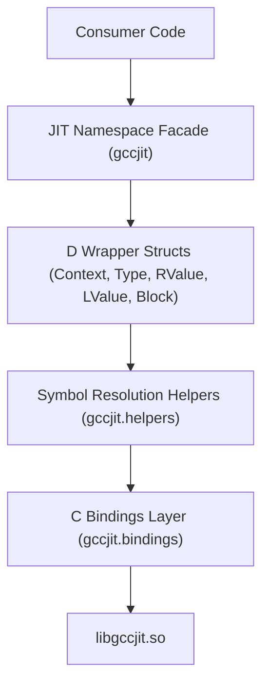

# Overview

**gccjitd** provides D bindings for `libgccjit`, GCC's library for compiling code at runtime.

With gccjitd, a D program can create types, variables, functions, and control flow, then ask GCC to compile that code into native machine code. This is useful when the code you want to run is only known at runtime, or when you want GCC's optimizer to generate the machine code for you.

You work with the JIT through a `Context`, which owns the objects created during compilation.

## What the API provides

The main parts of the API are:

- **`Context`** — The starting point for JIT compilation. It creates and manages types, functions, variables, and other JIT objects, and is used to compile the resulting code.
- **Types** — Built-in types as well as structures and vector types. You can use these to describe the data your generated code works with.
- **Values** — Expressions and values used when building code. `RValue` represents values that can be read, while `LValue` represents locations that can also be assigned to.
- **Functions** — Define the functions that your generated code will contain, including their parameters and return types.
- **Blocks** — Build the body of a function from blocks of statements. Blocks can contain assignments, calls, conditional branches, returns, and other operations.
- **Control flow** — Construct branches, loops, switches, and jumps without having to generate source code and invoke a compiler yourself.
- **Version and feature information** — Check which libgccjit features are available at runtime and query the version of the installed library.

The `gccjit` package brings these API types together, so typical code can use the library without having to know which module each type is defined in.

## A typical workflow

A JIT compilation generally looks like this:

1. Create a `Context`.
2. Define or obtain the types you need.
3. Declare the functions you want to generate.
4. Add blocks and statements to those functions.
5. Add the required control flow.
6. Compile the context.
7. Use the resulting native code.

The details of each step are covered in the API documentation.

## GCC and libgccjit versions

gccjitd works with the version of `libgccjit` installed on the system. Not every version of libgccjit provides the same API, so gccjitd exposes feature checks for functionality that may not be available everywhere.

For example, code can check whether a particular feature or version is supported before using it. This is useful when an application needs to work with multiple GCC versions.

The library also provides access to the underlying GCC JIT version through `gccjit.version_`.

## Build configurations

gccjitd can be used in both regular D programs and `betterC` programs.

- **Regular D** — The normal configuration, with the D runtime available.
- **`betterC`** — A configuration for programs that don't use the D runtime, such as programs that avoid the garbage collector and exceptions.

The project uses **DUB** for building. You will also need `libgccjit` installed and available to the linker at runtime.

See [Getting Started: Build, Configuration, and Installation](1.1-getting-started.md) for setup and build instructions.

## Subsystem Architecture

## Where to go next

- [Getting Started: Build, Configuration, and Installation](1.1-getting-started.md) — Set up gccjitd, configure DUB, and link against libgccjit.
- [Package Structure and Public API Surface](1.2-package-structure.md-package-structure.md) — Overview of the available modules and the `gccjit` API namespace.
