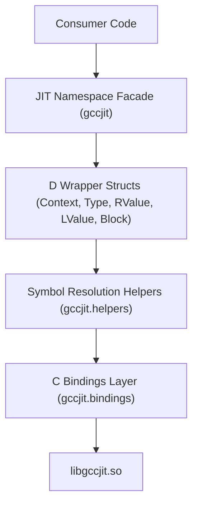

# Overview

gccjitd provides comprehensive D language bindings and an idiomatic object-oriented wrapper API for `libgccjit.so`, the GNU Compiler Collection's Just-In-Time compilation library.
It enables D applications to generate native machine code at runtime, construct complex control flow graphs, define data types, and compile functions dynamically without invoking external compiler binaries or parsing source files.

## Architectural Layers

The library is structured into distinct vertical layers that bridge raw low-level C entrypoints with high-level D idioms:

1. **C Bindings Layer** (`gccjit.bindings`): Provides raw `extern(C)` declarations, function prototypes, and opaque type definitions (`gcc_jit_context`, `gcc_jit_object`, `gcc_jit_rvalue`, etc.) corresponding directly to the upstream C header
2. **Symbol Resolution & Versioning** (`gccjit.helpers`): Manages dynamic symbol loading via runtime resolution using ifunc and Have string-mixin templates, allowing graceful feature detection across various versions of libgccjit.so.
3. **D Wrapper Structs** (`gccjit.object`, `gccjit.context`, `gccjit.types`, `gccjit.values`, `gccjit.block`, etc.): Implements zero-overhead value semantics using union-based inheritance, alias this typing, and idiomatic `opCast!bool` null checks.
4. **Namespace Facade** (`gccjit`): Aggregates all public submodules into a single central JIT struct using static imports and aliases

## Subsystem Architecture

## Child Pages

For deeper technical details on building, configuring, and structuring applications with gccjitd, refer to the child pages:

- [Getting Started: Build, Configuration, and Installation](1.1-getting-started.md) — Covers DUB configurations (library and betterC), Makefile targets, linking against libgccjit, and DUB sub-packages.
- [Package Structure and Public API Surface](1.2-package-structure.md-package-structure.md) — Explores the module layout and the role of the JIT struct as a namespace aggregator.