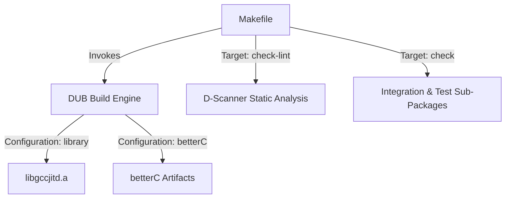

# Getting Started: Build, Configuration, and Installation

This page explains how to build gccjitd, configure it for regular D or `betterC`, and make sure your program can find GCC's JIT library.

## Requirements

gccjitd depends on GCC's `libgccjit` library. You need the library and its development files installed on your system.

On Debian-based systems, this is typically provided by a package named `libgccjit-N-dev`, where `N` is the GCC version.

You also need:

- [DUB](https://code.dlang.org/) to build the project.
- A D compiler supported by your setup. The project's Makefile uses GDC by default.
- `libgccjit` installed and available to the linker.

## Building with DUB

DUB is the primary build tool for gccjitd.

The default configuration builds the library for a normal D program:

```sh
dub build
```

gccjitd also provides a `betterC` configuration:

```sh
dub build --config=betterC
```

The normal configuration builds the `libgccjitd.a` static library. The `betterC` configuration builds the library without requiring the full D runtime.

## Build configurations

gccjitd provides two configurations.

### Standard configuration

The standard `library` configuration is the default. It allows you to use the normal D runtime, including features such as:

- Garbage collection
- D exceptions
- The usual D runtime support

This is the configuration to use for a typical D application.

### `betterC`

The `betterC` configuration is intended for programs that don't use the full D runtime.

It enables D's `betterC` mode and, when building with GDC, disables exception handling with `-fno-exceptions`.

Use this configuration when your application needs to avoid dependencies on the D runtime.

```sh
dub build --config=betterC
```

## Linking against libgccjit

gccjitd is a set of D bindings around GCC's `libgccjit` library, so applications using it also need `libgccjit`.

The dependency is declared by gccjitd's DUB configuration, which passes the equivalent of `-lgccjit` to the linker.

If the library isn't installed, you will typically see linker errors when building a program that uses gccjitd.

Make sure the appropriate `libgccjit` development package for your GCC installation is installed before building.

## Using the Makefile

The project also includes a Makefile that provides convenient commands for building and testing the library.

Build the library with:

```sh
make
```

Run the test and verification suite with:

```sh
make check
```

Clean generated build files with:

```sh
make clean
```

The Makefile is mainly useful when working on gccjitd itself. If you're simply using gccjitd as a dependency, DUB is generally all you need.

### Useful Makefile targets

The following targets are available for individual parts of the test suite:

- `make check-brainf`
- `make check-capi`
- `make check-dapi`
- `make check-gccjitd`
- `make check-lint`
- `make check-square`
- `make check-sum-squares`
- `make check-toylang`
- `make check-toyvm`
- `make check-unittests`

The exact compiler and build type can also be selected through Makefile variables. The default setup uses GDC and a debug build.



## Testing

The repository contains several test programs and examples under `test/`. These are useful both for checking the library and for seeing how gccjitd can be used.

The test projects include:

- **`brainf`** — A small Brainfuck compiler implemented using the JIT.
- **`capi`** — Tests the C-level API bindings.
- **`dapi`** — Tests the higher-level D API.
- **`square`** — A simple example that generates code to square a value.
- **`sum-squares`** — A JIT example involving multiple calculations.
- **`toylang`** — A small language/compiler example.
- **`toyvm`** — A toy virtual machine that uses JIT compilation.
- **`unittests`** — The main unit-test suite, including tests for the standard and `betterC` configurations.

You normally don't need to build these individually. Running `make check` runs the relevant tests and verification steps.

## Cleaning the build

To remove generated build artifacts and DUB's cached build files:

```sh
make clean
```

This is useful if you want to perform a clean rebuild or have changed compiler or build configuration options.

## Continuous integration

The project tests gccjitd against multiple GCC/libgccjit versions in its CI environment. This is particularly relevant because different versions of GCC can provide different versions of the libgccjit API.

For users, the important point is that **the version of libgccjit installed on your system matters**. If you need a feature introduced in a newer GCC release, check the available feature or version information before relying on it.

See the API documentation for details on checking libgccjit features at runtime.

## Next steps

Once gccjitd is built and its `libgccjit` dependency is available, you can start creating a JIT compilation context and generating code.

See the API documentation for `JIT.Context` and the other core types to get started.
