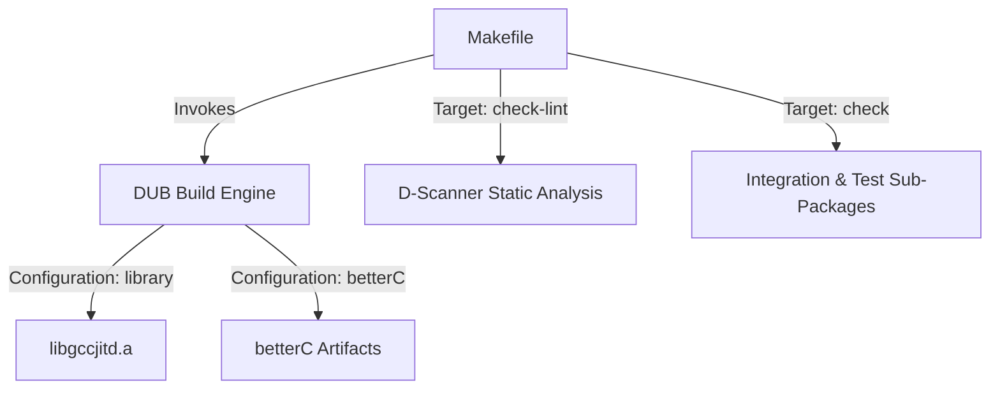
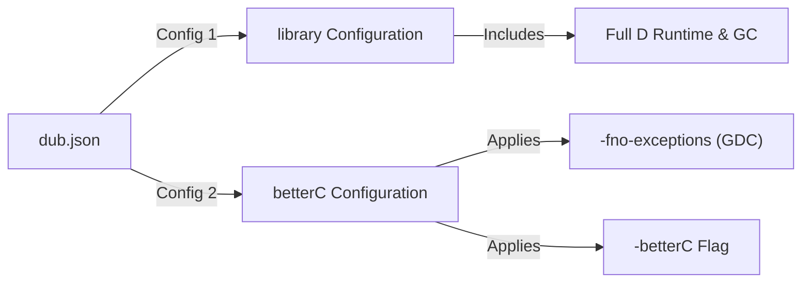
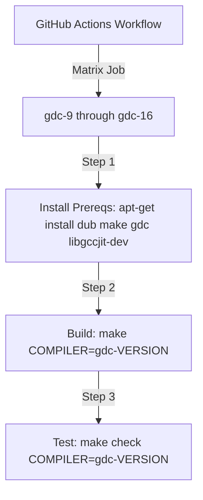

# Getting Started: Build, Configuration, and Installation

This page covers the build infrastructure, configuration options, linking requirements, code linting, continuous integration workflow, and test sub-package organization for gccjitd. It details how to compile the D bindings for libgccjit using DUB and the GNU Make wrapper, manage build configurations, and run verification routines.

## 1. Build Systems: DUB and the Makefile

gccjitd uses [DUB](https://code.dlang.org/) as its primary package manager and build tool, complemented by a Makefile wrapper that automates building, testing, linting, and cleaning artifacts across multiple configurations and test targets.

The Makefile defines variables for the D compiler (defaulting to gdc), the DUB executable, and the build type (defaulting to debug).

### Key Makefile Targets

- `make all`: Invokes dub build using the configured compiler and build flags.
- `make check`: Runs the comprehensive verification suite, executing package unit tests, all demo/integration test suites, and D-scanner syntax/style checks (individual tests can be ran with `check-brainf`, `check-capi`, `check-dapi`, `check-gccjitd`, `check-lint`, `check-square`, `check-sum-squares`, `check-toylang`, `check-toyvm`, `check-unittests`).
- `make clean`: Removes generated build artifacts and invokes `dub clean`

## 2. Build Configurations: library vs betterC

The dub.json manifest defines two distinct compilation configurations for gccjitd:

1. `library`: The standard, default configuration.
    It compiles with full D runtime support (object.d, garbage collection, exception handling).
2. `betterC`: A lightweight configuration intended for embedding or zero-runtime environments.
    It explicitly applies the "betterC" build option and passes `-fno-exceptions` specifically to GDC, disabling the D runtime, class support, and exception unwinding.

## 3. Linking Against libgccjit

Because gccjitd provides thin bindings over GCC's shared JIT compilation library, consumer applications and test suites must link against libgccjit. This is declared statically in the top-level DUB manifest via the `"libs"` property.

At runtime, entrypoints are resolved dynamically (see subsequent sections on binding symbol resolution), but the linker must be able to locate and load `libgccjit.so` (or the appropriate platform equivalent) at link time.
 
## 4. Continuous Integration and Linting
 
`gccjitd` enforces code hygiene and multi-version compatibility through automated linting and GitHub Actions CI pipelines.
 
### Static Analysis Configuration

Static analysis is configured via `dscanner.ini`. Key rules include:
* `style_check="disabled"`: Disables strict Phobos style enforcement.
* `object_const_check="enabled"`: Ensures `opEquals`, `opCmp`, `toHash`, and `toString` are correctly qualified as `const`, `immutable`, or `inout`.
* `undocumented_declaration_check="-gccjit.bindings"`: Excludes the raw C bindings module from undocumented declaration checks.
 
### CI Matrix Workflows
The CI workflow runs on Ubuntu runners, testing `gccjitd` against a matrix of GDC and `libgccjit` development package versions ranging from version 9 up to version 16. Each test run installs prerequisites (`dub`, `make`, `gdc`, `libgccjit-dev`), builds the library, and runs `make check`.
 

## 5. DUB Sub-Packages Under test/

The top-level dub.json registers several sub-packages under the `test/ directory`.
While these sub-packages are strictly test fixtures, benchmarks, and example drivers rather than part of the public API surface, they are built and executed by the Makefile verification targets.

| DUB Sub-Package Path | Purpose |
| ---------------------|---------|
| :brainf       | Brainfuck JIT compiler implementation |
| :capi         | C-API parity test harness |
| :dapi         | D-API integration test harness |
| :square	    | Simple squaring JIT test |
| :sum-squares	| Sum-of-squares JIT test |
| :toylang      | Toy language compiler driver |
| :toyvm        | Toy virtual machine JIT executor |
| :unittests    | Dedicated test suite runner for library and betterC |