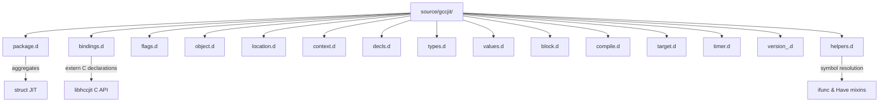
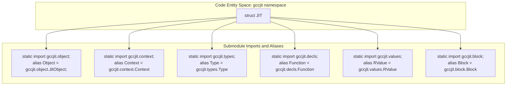

# Package Structure and Public API Surface

This page details the physical layout of the gccjit package under source/gccjit/, the organization of its submodules, and how the JIT struct in source/gccjit/package.d functions as a pure namespace aggregator via static import and alias declarations.

## Package Layout and Submodule Organization

The gccjitd library organizes its D bindings and wrappers into a cohesive set of files within the `source/gccjit/` directory. Each file encapsulates a distinct architectural layer or functional subsystem of the libgccjit API.

The submodules exposed by the package include:

- `gccjit.bindings`: Raw `extern (C)` declarations mapping directly to libgccjit entry points.
- `gccjit.flags`: Configuration enumerations (`FunctionType`, `GlobalKind`, `CType`, `UnaryOp`, `BinaryOp`, etc.).
- `gccjit.object`: Base wrapper struct `JIT.Object`.
- `gccjit.location`: Source location wrapper (`JIT.Location`).
- `gccjit.context`: Compilation context factory and manager (`Context`).
- `gccjit.decls`: Declarations including `JIT.Field`, `JIT.Function`, and `JIT.Parameter`.
- `gccjit.types`: Type system wrappers (`JIT.Type`, `JIT.Struct`, `JIT.FunctionPtrType`, `JIT.VectorType`).
- `gccjit.values`: Expression and storage wrappers (`JIT.RValue`, `JIT.LValue`).
- `gccjit.block`: Control flow and statements (`JIT.Block`, `JIT.Case`, `JIT.ExtendedAsm`).
- `gccjit.compile`: Compilation result wrapper (`JIT.CompileResult`).
- `gccjit.target`: Target information queries (`JIT.TargetInfo`).
- `gccjit.timer`: Profiling and phase timing (`JIT.Timer`, `JIT.AutoTime`).
- `gccjit.version_`: Library version querying (`JIT.Version`).
- `gccjit.helpers`: Symbol resolution infrastructure (`ifunc` and `Have` string-mixin templates).

## The JIT Struct Namespace Facade

In the `gccjit` module, the `JIT` struct serves as a pure namespace aggregator.
It contains no instance state, constructors, or member methods other than static feature-flag check functions.
Instead, it uses `static import` combined with `alias` statements to bring all primary public wrapper structs into the `gccjit` module namespace.

Consumers can reference types either through the `JIT` aggregator (e.g., `JIT.Context`, `JIT.RValue`, `JIT.Function`) or by importing individual submodules directly, as `package.d` also makes `gccjit.bindings` and `gccjit.flags` publicly available.

## Runtime Feature Flags (`Have_*`)

Because libgccjit avoids SONAME bumps and instead versions individual symbols, gccjitd exposes optional library features behind per-symbol `Have_*` runtime feature flags defined statically inside the JIT struct.

Each `Have_*` function uses the `Have` string-mixin template to verify that the underlying C symbols can be dynamically resolved at runtime.

Consumer code should always check these flags (such as `JIT.Have_Reflection`, `JIT.Have_Timing_API`, `JIT.Have_Version`, and `JIT.Have_TargetInfo_API`) before invoking methods that depend on newer libgccjit symbol sets.