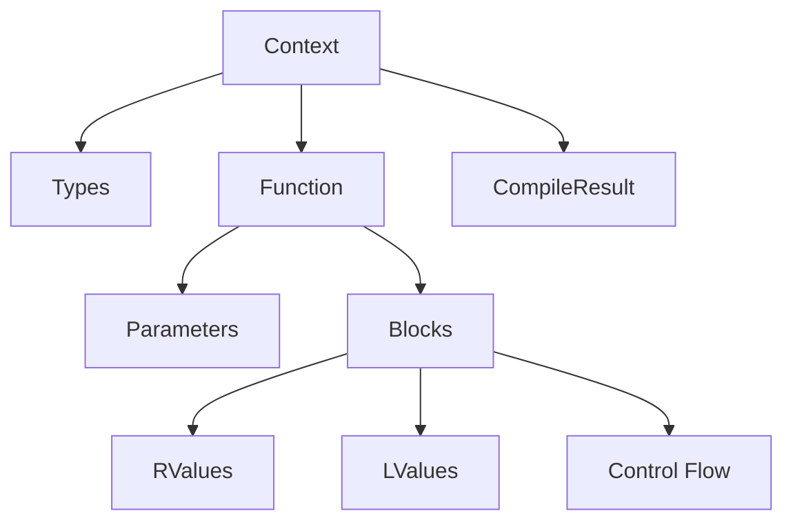

# Package Structure and Public API

gccjitd exposes the libgccjit API through the `gccjit` package. Most applications only need to import this package and can access the main API types through the `JIT` namespace.

The library is split into several modules internally, but you generally don't need to know how those modules are organised to use the API.

## The `gccjit` Package

The usual starting point is:

```d
import gccjit;
```

The package provides the `JIT` namespace, which brings the main API types together.

For example:

```d
JIT.Context context;
JIT.Type intType;
JIT.Function funcdecl;
JIT.Block block;
JIT.RValue value;
```

This keeps application code from having to import every individual gccjitd module.

## Main API Types

The most commonly used types are:

| Type                  | Purpose                                                     |
| --------------------- | ----------------------------------------------------------- |
| `JIT.Context`         | Creates and manages JIT objects and performs compilation.   |
| `JIT.Type`            | Describes a type used by generated code.                    |
| `JIT.Struct`          | Defines a structure type.                                   |
| `JIT.Function`        | Defines a function to be generated.                         |
| `JIT.Parameter`       | Describes a function parameter.                             |
| `JIT.Field`           | Describes a field in a structure.                           |
| `JIT.Block`           | Contains the statements and control flow of a function.     |
| `JIT.RValue`          | Represents a value or expression that can be read.          |
| `JIT.LValue`          | Represents a value that can also be assigned to.            |
| `JIT.FunctionPtrType` | Represents a function pointer type.                         |
| `JIT.VectorType`      | Represents a vector type.                                   |
| `JIT.CompileResult`   | Represents the result of compiling a context.               |
| `JIT.Location`        | Describes a source location associated with generated code. |
| `JIT.Case`            | Describes a case in a switch statement.                     |
| `JIT.ExtendedAsm`     | Represents an inline assembly statement.                    |
| `JIT.TargetInfo`      | Provides information about the compilation target.          |
| `JIT.Version`         | Provides information about the installed libgccjit version. |
| `JIT.Timer`           | Provides timing information for JIT compilation.            |
| `JIT.AutoTime`        | Convenience support for timing JIT operations.              |

The API also provides enumerations and constants for things such as:

- Function and global variable kinds
- C-compatible types
- Unary operators
- Binary operators
- Other libgccjit options and flags

These are available through `gccjit.flags`.

## How the Main Types Fit Together

A typical JIT program starts with a `Context`. The context is then used to create functions, types, and other objects.

A function contains one or more `Block`s. Blocks contain the operations that make up the function, using `RValue`s and `LValue`s to represent values and storage.

Finally, the context is compiled to produce a `CompileResult`.



A simplified workflow looks like this:


See the documentation for `Context` and the individual API types for details.

## Low-Level C Bindings

The `gccjit.bindings` module contains the low-level bindings to the C libgccjit API.

Most users should not need to use this module directly. It is available for code that needs access to an API entry point that isn't exposed by the higher-level D wrappers.

The higher-level API uses these bindings internally.

## Runtime Feature Detection

Different versions of libgccjit provide different APIs. gccjitd therefore provides feature checks for functionality that may not be available in every installed version.

Before using an optional feature, check the corresponding `JIT.Have_*` function.

For example:

```d
if (JIT.Have_Switch_Statements)
{
   // Switch statement support is available.
}
```

Feature checks are available for functionality including:

- `JIT.Have_Switch_Statements`
- `JIT.Have_Timing_API`
- `JIT.Have_Version`
- `JIT.Have_Reflection`
- `JIT.Have_Asm_Statements`

These checks are particularly useful if your application may run on systems with different GCC/libgccjit versions.

## Choosing What to Import

For normal application code, simply import the top-level package:

```d
import gccjit;
```

The public API types are then accessed through the `JIT` namespace:

```d
JIT.Context context;
JIT.Function funcdecl;
JIT.Type type;
```

The individual gccjitd implementation modules are not part of the public API. You don't need to know which module defines a particular type; use the corresponding type through `JIT`.

For example, `JIT.Context`, `JIT.Function`, `JIT.Type`, and `JIT.RValue` are all available from the single `gccjit` import.

If you specifically need the low-level C bindings or the flags and enumerations, `gccjit.bindings` and `gccjit.flags` can be imported directly.

## Summary

The public API can be thought of in four broad groups:

- **Context and compilation** — `Context`, `CompileResult`
- **Code construction** — `Function`, `Block`, `RValue`, `LValue`
- **Types and declarations** — `Type`, `Struct`, `Parameter`, `Field`
- **Additional information and features** — `TargetInfo`, `Version`, `Timer`, feature checks

All of these types are accessed through the `JIT` namespace. You generally only need:

```d
import gccjit;
```

The exceptions are the low-level `gccjit.bindings` module and the `gccjit.flags` module, which can be imported directly when needed.
