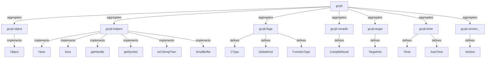
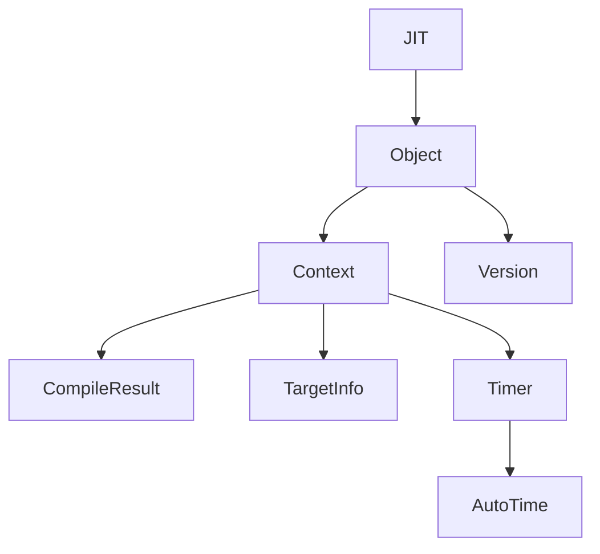

# Glossary

This page provides comprehensive definitions and code pointers for codebase-specific terms, architectural patterns, helper mechanisms, enums, and core wrapper structs used throughout gccjitd.

## JIT Namespace Facade and Core Wrappers

### JIT Facade

The central namespace aggregator defined in the `gccjit` package.
It uses static imports and alias declarations to expose all submodules (`Object`, `Location`, `Context`, `Field`, `Function`, `Parameter`, `Type`, `Struct`, `FunctionPtrType`, `VectorType`, `Block`, `Case`, `ExtendedAsm`, `RValue`, `LValue`, `CompileResult`, `Timer`, `AutoTime`, `Version`, `TargetInfo`) under a single `JIT` struct namespace.

### JIT.Object

The base wrapper struct for all JIT entities (`gcc_jit_object*`).
It provides foundational methods such as `get_context()`, `toString()`, and the `opCast!bool` null-check convention.

## Symbol Resolution and Helper Mechanisms

### ifunc Mixin

A D string-mixin template that generates a module-level function pointer (`c_<name>`) initialised to a lazy self-patching stub.
On the first invocation, the stub resolves the symbol via `getSymbol`, rewrites the function pointer, and forwards the call (or invokes `abort` if unresolved). Note: This is a D template named `ifunc`, unrelated to the GCC `ifunc`/`STT_GNU_IFUNC` ELF attribute.

### Have Mixin

A D string-mixin template utilized by the gccjit package
to generate `JIT.Have_*` feature-flag methods. Each method caches a tristate `__gshared byte` and returns true only when all specified C symbols successfully resolve at runtime.

### getHandle / getSymbol

Low-level symbol resolution helpers. `getHandle()` retrieves the handle of the main executable via `dlopen(null, RTLD_LAZY)` on POSIX systems or `GetModuleHandleA(null)` on Windows. `getSymbol()` wraps `dlsym` or `GetProcAddress` to look up symbol addresses.

### toCStringThen

A helper function that copies a D string slice into a null-terminated C string (`\0`) using a stack-allocated or heap-fallback buffer, executes a delegate dg, and cleans up automatically without heap allocation overhead for typical inputs.

### SmallBuffer

A non-copyable, stack-backed buffer struct that uses a fixed local array as storage and transparently falls back to `malloc` / `free` if the requested length exceeds the local buffer capacity.

### abort

A utility function that prints an error message to `stderr` and immediately terminates the runtime via standard `abort()`.

## Language Conventions and Design Patterns

### opCast!bool Convention

An idiomatic null-checking convention implemented across all public wrapper structs (except `JIT.Timer`, `JIT.AutoTime`, and `JIT.Version`)
Defined as `bool opCast(T : bool)() const nothrow @nogc`, it returns whether the underlying C pointer handle is non-null, enabling expressions like `if (context)` or `cast(bool) rvalue`.

### alias this Inheritance

A D language feature combined with union storage layout used across wrapper structs to model subtype hierarchies (e.g., `JIT.LValue` inheriting from `JIT.RValue`, and `JIT.Parameter` inheriting from `JIT.LValue`).

### Opaque Struct

Forward-declared or incomplete C struct types (e.g., `gcc_jit_struct`) used to support self-referential data structures and encapsulation where internal fields are hidden from the client.

### dyncast

Dynamic type-checking and downcasting methods implemented on `JIT.Type` (e.g., `dyncast_function_ptr_type`, `dyncast_vector`, `dyncast_array`) that safely inspect type categories at runtime.

## Enumerations and Configuration Flags

### CType

An enumeration (`CType`) mapping primitive, standard, and target-dependent types (such as `Int`, `Double`, `SizeT`, `Int128t`, `BFloat16`, `Float128`) to their `GCC_JIT_TYPE_*` C equivalents.

### GlobalKind

An enumeration (`GlobalKind`) specifying global variable linkage and visibility (`Exported`, `Internal`, `Imported`).

### FunctionType

An enumeration (`FunctionType`) defined in source/gccjit/flags.d
source/gccjit/flags.d#24-38 specifying function linkage and inline behavior (`Exported`, `Internal`, `Imported`, `AlwaysInline`).

### OutputKind

An enumeration specifying the compilation output format (such as assembler code, object files, dynamic libraries, or executables) when compiling via `JIT.Context.compile_to_file`.

### TlsModel

An enumeration (`TlsModel`) specifying thread-local storage models for global variables.

### FnAttribute / VarAttribute

Enumerations representing function and variable attributes applied during declaration configuration.

## Compilation Output, Targets, Profiling, and Build Configurations

### CompileResult

A wrapper struct wrapping `gcc_jit_result`, returned by `JIT.Context.compile()` and `JIT.Context.compile_to_file()`. It provides `get_code()`, `get_global()`, and `release()` methods.

### TargetInfo

A wrapper struct obtained via `JIT.Context.get_target_info()`. It exposes target capability queries such as `cpu_supports()`, `arch()`, and `supports_type()`, gated by `JIT.Have_TargetInfo_API`.

### Timer / AutoTime

Profiling structures. `JIT.Timer` wraps gcc_jit_timer for tracking compilation phases, while `JIT.AutoTime` is an RAII template that automatically pushes and pops named timing scopes. Both are gated by `JIT.Have_Timing_API`.

### Version

A static, non-instantiable struct that queries major, minor, and patchlevel version numbers of the loaded libgccjit library, gated by `JIT.Have_Version`.

### betterC Configuration

A DUB build configuration option that compiles gccjitd without the D runtime and disables exceptions (`-fno-exceptions`), making it suitable for bare-metal or C-integrated environments.

## Subsystem Architecture Mapping

*Figure 10.1: Mapping of codebase subsystem files to core architectural glossary terms.*

*Figure 10.2: Code entity relationship tree for core wrappers and state managers.*