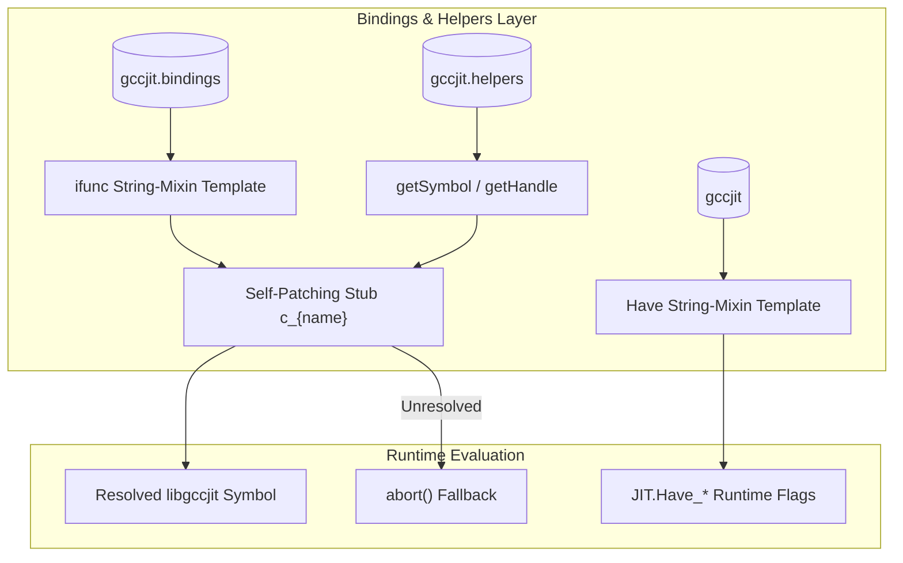
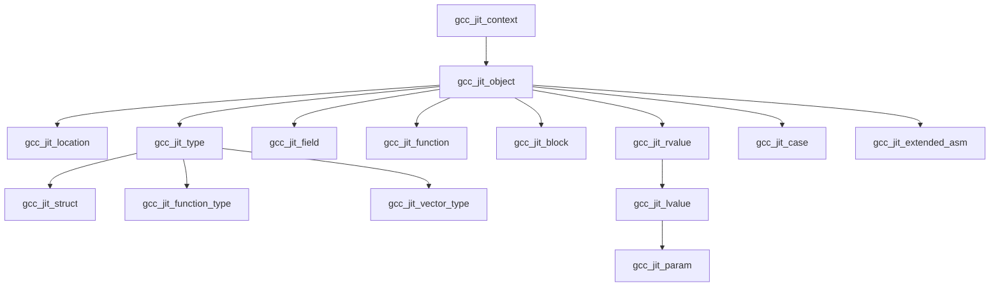

# C Bindings Layer (gccjit.bindings)

The C bindings layer forms the raw, low-level interface between gccjitd and the [upstream libgccjit C library](https://gcc.gnu.org/onlinedocs/jit/topics/index.html). Located primarily in `gccjit.bindings`, this layer translates C headers into D `extern(C)` function declarations and opaque struct definitions.
Because libgccjit eschews traditional SONAME version bumps in favor of per-symbol versioning, gccjitd pairs these raw declarations with a dynamic symbol loading and feature-flagging mechanism.

For deep dives into specific sub-topics, refer to the following child pages:

- [libgccjit Symbol Versioning and Dynamic Symbol Loading](2a-symbol-versioning.md)
- [C API Reference: Opaque Types and Function Declarations](2b-c-api.md)
- [gccjit.version_: libgccjit Version Querying](2c-version-querying.md)

## 2.1 libgccjit Symbol Versioning and Dynamic Symbol Loading

Because libgccjit adds features across minor releases without changing the library SONAME, direct link-time dependency can cause runtime failures on older host systems. The bindings layer solves this by loading symbols dynamically at runtime using `getHandle()` and `getSymbol()` (wrapping `dlopen`/`dlsym` on POSIX and `GetModuleHandleA`/`GetProcAddress` on Windows).

The `ifunc` string-mixin template generates self-patching stubs for each versioned entrypoint, while the `Have` string-mixin template populates the `JIT.Have_*` runtime capability flags. If client code attempts to invoke an unresolved function, the stub falls back to calling an abort handler. For full details on symbol resolution, self-patching stubs, and feature flags, see [libgccjit Symbol Versioning and Dynamic Symbol Loading](2a-symbol-versioning.md).

*Figure 2.1: Dynamic symbol resolution and feature gating flow in gccjit.bindings and gccjit.helpers.*

## 2.2 C API Reference: Opaque Types and Function Declarations

The `gccjit.bindings` module declares all upstream opaque C structures and `extern(C)` entrypoints.
All JIT data structures—such as `gcc_jit_context`, `gcc_jit_object`, `gcc_jit_rvalue`, `gcc_jit_lvalue`, and `gcc_jit_block` — are modeled as opaque structs to prevent direct manipulation of internal compiler states by client code.

*Figure 2.2: Opaque C struct inheritance and hierarchy defined in gccjit.bindings.*

For a comprehensive catalog of the opaque types, function signatures, enums, and their direct mappings to libgccjit, see [C API Reference: Opaque Types and Function Declarations](2.2-c-api.md).

## 2.3 gccjit.version_: libgccjit Version Querying

`gccjit.version_` provides a static, non-instantiable `JIT.Version` struct that exposes runtime version queries (`gcc_jit_version_major`, `gcc_jit_version_minor`, and `gcc_jit_version_patchlevel`). This capability is guarded by the `JIT.Have_Version` runtime feature flag.

Because version querying depends on symbols introduced in later iterations of libgccjit, client code must verify `JIT.Have_Version` before accessing version properties. For implementation details and usage patterns, see [gccjit.version_: libgccjit Version Querying](2.3-version-querying.md).