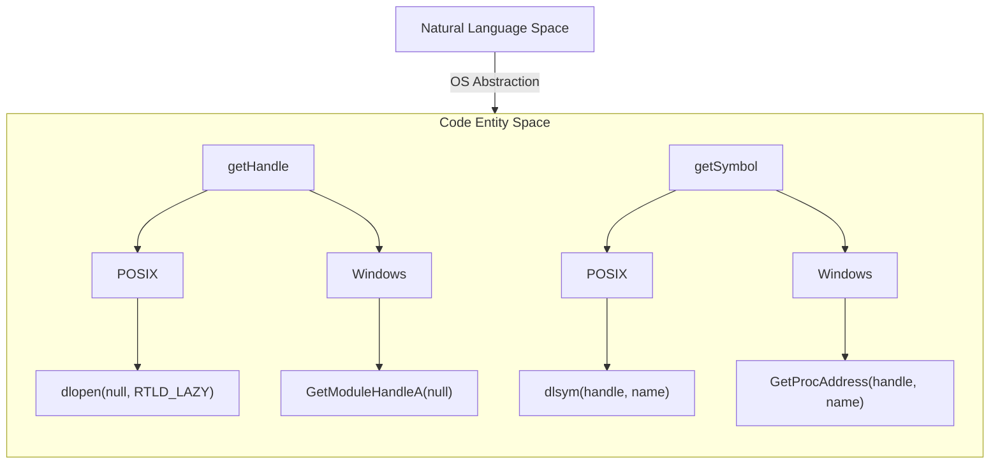
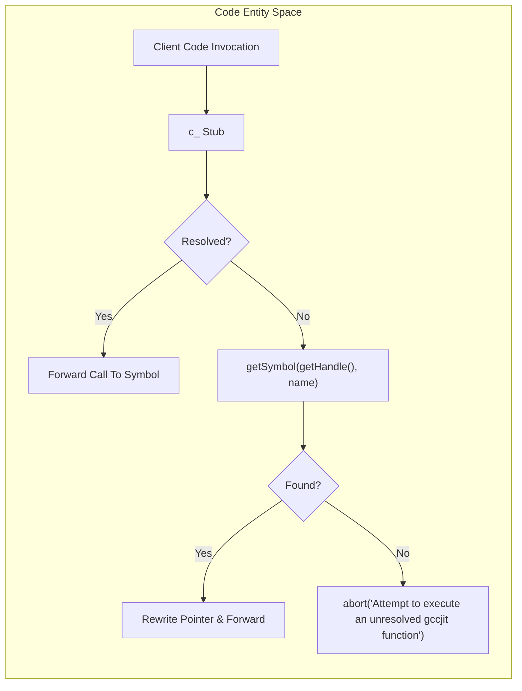

# libgccjit Symbol Versioning and Dynamic Symbol Loading

## Purpose and Scope

This page details how gccjitd resolves libgccjit symbols at runtime to cope with different versions of `libgccjit.so` exporting varying symbol sets without relying on link-time dependencies or SONAME version bumps. It covers the core runtime lookup functions (`getHandle` and `getSymbol`), the `ifunc` and `Have` string-mixin templates, self-patching function stubs, the feature-flag methods (`JIT.Have_*`) generated in the gccjit module, and the process-abort fallback when an unresolved entrypoint is invoked.

## Runtime Symbol Resolution: getHandle and getSymbol

To avoid binding directly to a specific `libgccjit.so` at link time, gccjitd inspects the host process's loaded symbols. Symbol resolution is centralized in `gccjit.helpers` using platform-specific dynamic loading APIs.

`getHandle()` retrieves the handle of the main executable using `dlopen(null, RTLD_LAZY)` on POSIX systems or `GetModuleHandleA(null)` on Windows. Once the handle is obtained, `getSymbol()` wraps `dlsym` or `GetProcAddress` to query for a specific symbol name and assign its address to a target pointer.

*Figure 1: Association between symbol resolution concepts and implementation functions in gccjit.helpers.*

## The ifunc String-Mixin Template and Self-Patching Stubs

Because libgccjit evolves by adding new entrypoints rather than bumping SONAME, individual functions may or may not be present in the loaded library. The D template named `ifunc` (distinct from GCC `ifunc`/`STT_GNU_IFUNC`) generates module-level function pointers (`c_<name>`) initialized to a lazy self-patching stub.

When a wrapped C function is called for the first time:

1. The stub checks if the resolved function pointer has already been updated.
2. If uninitialized, it invokes `getHandle()` and `getSymbol()` to resolve the symbol.
3. If the symbol is found, the function pointer is rewritten to point directly to the resolved address, and the call is forwarded.
4. If the symbol cannot be found, the stub invokes `abort` with the error message `Attempt to execute an unresolved gccjit function: <name>`.

The statement `alias <name> = c_<name>` makes the resolved pointer fully transparent and usable as a plain function call throughout the bindings.

*Figure 2: Execution flow of the lazy self-patching stub generated by the ifunc mixin.*

## Feature Detection via the `Have` Template and `JIT.Have_*` Flags

To allow client code to gracefully handle different versions of libgccjit, gccjitd exposes feature flags through the `JIT` struct facade in the `gccjit` module.

The `Have` template generates `static` methods such as `JIT.Have_Reflection()`, `JIT.Have_Timing_API()`, `JIT.Have_Version()`, and `JIT.Have_TargetInfo_API()`. Each generated flag caches a tristate `__gshared` byte and evaluates to `true` only when every C symbol listed in its requirements successfully resolves via `getSymbol`.

| JIT Feature Flag | Associated C Symbols |
|------------------|----------------------|
| JIT.Have_Context_add_command_line_option | `gcc_jit_context_add_command_line_option` |
| JIT.Have_Context_set_allow_unreachable_blocks | `gcc_jit_context_set_bool_allow_unreachable_blocks` |
| JIT.Have_Switch_Statements | `gcc_jit_block_end_with_switch`, `gcc_jit_context_new_case`, etc. |
| JIT.Have_Timing_API | `gcc_jit_context_get_timer`, `gcc_jit_timer_new`, etc. |
| JIT.Have_Context_set_use_external_driver | `gcc_jit_context_set_bool_use_external_driver` |
| JIT.Have_RValue_set_require_tail_call | `gcc_jit_rvalue_set_bool_require_tail_call` |
| JIT.Have_Type_get_aligned | `gcc_jit_type_get_aligned` |
| JIT.Have_Type_get_vector | `gcc_jit_type_get_vector` |
| JIT.Have_Function_get_address | `gcc_jit_function_get_address` |
| JIT.Have_Context_new_rvalue_from_vector | `gcc_jit_context_new_rvalue_from_vector` |
| JIT.Have_Context_add_driver_option | `gcc_jit_context_add_driver_option` |
| JIT.Have_Context_new_bitfield | `gcc_jit_context_new_bitfield` |
| JIT.Have_Version | `gcc_jit_version_major`, `gcc_jit_version_minor`, `gcc_jit_version_patchlevel` |
| JIT.Have_LValue_set_initializer | `gcc_jit_global_set_initializer` |
| JIT.Have_Asm_Statements | `gcc_jit_block_add_extended_asm`, `gcc_jit_extended_asm_as_object`, etc. |	
| JIT.Have_Reflection | `gcc_jit_function_get_return_type`, `gcc_jit_type_is_bool`, etc. |
| JIT.Have_LValue_set_tls_model | `gcc_jit_lvalue_set_tls_model` |
| JIT.Have_LValue_set_link_section | `gcc_jit_lvalue_set_link_section` |
| JIT.Have_Ctors | `gcc_jit_context_new_array_constructor`, `gcc_jit_context_new_struct_constructor`, etc. |
| JIT.Have_Sized_Integers | `gcc_jit_compatible_types`, `gcc_jit_type_get_size` |
| JIT.Have_Context_new_bitcast | `gcc_jit_context_new_bitcast` |
| JIT.Have_LValue_set_register_name | `gcc_jit_lvalue_set_register_name` |
| JIT.Have_Context_set_print_errors_to_stderr | `gcc_jit_context_set_bool_print_errors_to_stderr` |
| JIT.Have_Alignment | `gcc_jit_lvalue_set_alignment`, `gcc_jit_lvalue_get_alignment` |
| JIT.Have_Type_get_restrict | `gcc_jit_type_get_restrict` |
| JIT.Have_Attributes | `gcc_jit_function_add_attribute`, `gcc_jit_function_add_string_attribute`, etc. |
| JIT.Have_Context_new_sizeof | `gcc_jit_context_new_sizeof` |
| JIT.Have_Context_new_alignof | `gcc_jit_context_new_alignof` |
| JIT.Have_LValue_set_readonly | `gcc_jit_global_set_readonly` |
| JIT.Have_Context_convert_vector | `gcc_jit_context_convert_vector` |
| JIT.Have_Vector_Operations | `gcc_jit_context_new_vector_access`, `gcc_jit_context_new_rvalue_vector_perm` |
| JIT.Have_Context_get_target_builtin_function | `gcc_jit_context_get_target_builtin_function` |
| JIT.Have_Function_new_temp | `gcc_jit_function_new_temp` |
| JIT.Have_Context_set_output_ident | `gcc_jit_context_set_output_ident` | 
| JIT.Have_TargetInfo_API | `gcc_jit_context_get_target_info`, `gcc_jit_target_info_release`, etc. |
| JIT.Have_Context_set_abort_on_unsupported_target_builtin | `gcc_jit_context_set_abort_on_unsupported_target_builtin` |
| JIT.Have_Context_new_array_type_u64 | `gcc_jit_context_new_array_type_u64` |

## The Abort Fallback

If client code bypasses the `JIT.Have_*` guards and invokes an entrypoint whose symbol is absent from the loaded `libgccjit.so`, dynamic resolution fails.

When `getSymbol` returns `null`, the self-patching stub does not throw exceptions (as exceptions and garbage collection are omitted in this library structure, especially under `betterC` configurations). Instead, it calls `abort`, which prints the error message directly to `stderr` via `fputs` and immediately terminates the process via the standard library `abort()` function.