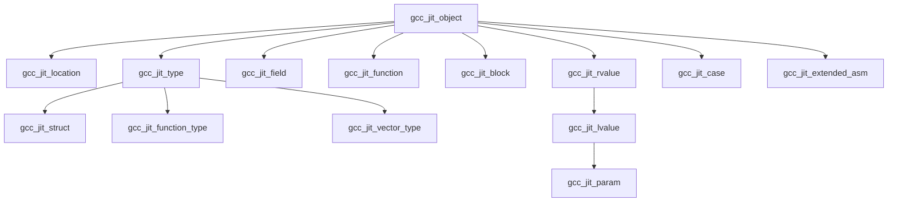
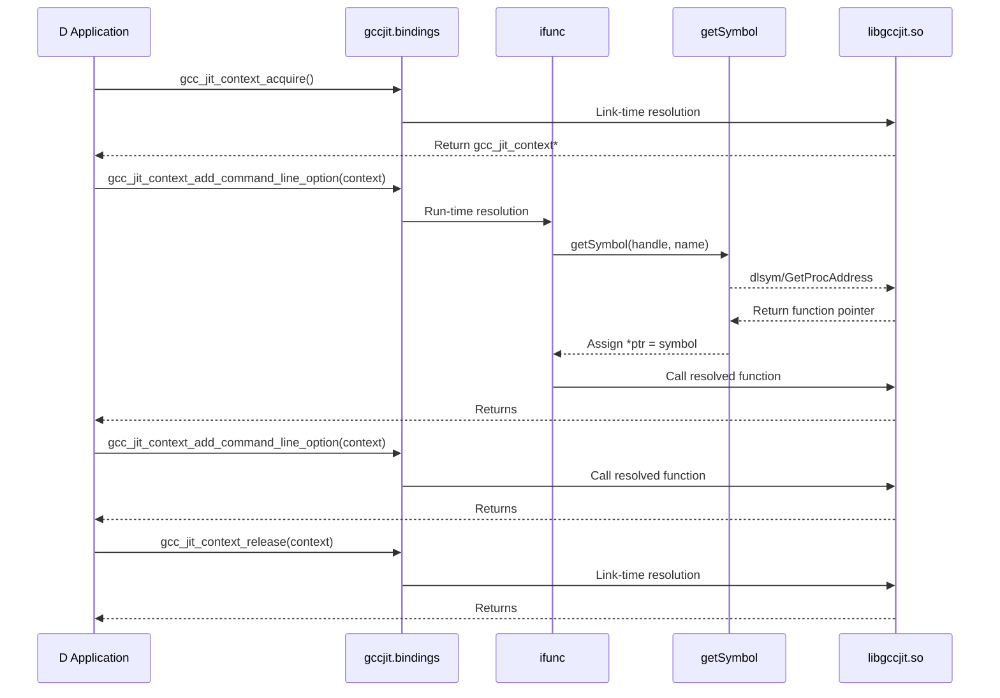

# C API Reference: Opaque Types and Function Declarations

## Purpose and Scope

The `gccjit.bindings` module provides the raw `extern(C)` binding layer that interfaces directly with `libgccjit.so`. All types defined within this module are opaque C structs, mirroring the upstream `libgccjit.h` header. Because D can safely model forward-declared C structs as empty struct definitions (`struct name;`), the binding layer establishes strict type safety without exposing internal layout details of GCC's JIT infrastructure.

In addition to struct definitions, this layer declares the complete set of C entrypoints exposed by `libgccjit`, decorated with `extern(C)`, `nothrow`, and `@nogc` attributes.

## The Opaque C Struct Hierarchy

All compilation state, entities, expressions, and control-flow constructs are represented in the C API as pointers to opaque structs. The root of the entity hierarchy is `gcc_jit_object`, which models any object created within a compilation context

### Summary of Opaque Structs

| Struct Name | Upstream C Definition / Purpose |
|-------------|---------------------------------|
| gcc_jit_context | Encapsulates the state of a compilation session. |
| gcc_jit_result | Encapsulates the in-memory machine code result of compilation. |
| gcc_jit_target_info | Encapsulates target-specific hardware capabilities and info. |
| gcc_jit_object | Base class for all context-allocated entities. |
| gcc_jit_location | Encapsulates source code locations for debugging. |
| gcc_jit_type | Encapsulates a data type (e.g. int, struct pointers). |
| gcc_jit_field | Encapsulates a field within a composite struct type. |
| gcc_jit_struct | Encapsulates a struct type (complete or opaque). |
| gcc_jit_function_type | Encapsulates a function signature type. |
| gcc_jit_vector_type | Encapsulates a SIMD vector type. |
| gcc_jit_function | Encapsulates a function definition or imported reference. |
| gcc_jit_block | Encapsulates a basic block of statements (single entry/exit). |
| gcc_jit_rvalue | Encapsulates an expression yielding a value. |
| gcc_jit_lvalue | Encapsulates an assignable storage location (inherits rvalue). |
| gcc_jit_param | Encapsulates a function parameter (inherits lvalue/rvalue). |
| gcc_jit_case | Encapsulates a switch statement branch case. |
| gcc_jit_extended_asm | Encapsulates low-level extended assembly statements. |

## Object Inheritance Tree

The upstream C headers conceptually organize JIT objects into an inheritance hierarchy. The D bindings reflect this logical hierarchy through structural relationships and subsequent wrapper casting in the D API layer.

*Figure 1: Opaque C Object Inheritance Hierarchy*

## Function Declarations and ABI Mapping

Functions exported by `libgccjit` are declared within `gccjit.bindings` under `extern(C)`, `nothrow`, and `@nogc` attributes.

Lifecycle management functions such as context acquisition and release establish the root entry points for interaction with the library

*Figure 2: Binding Layer Interaction with libgccjit*