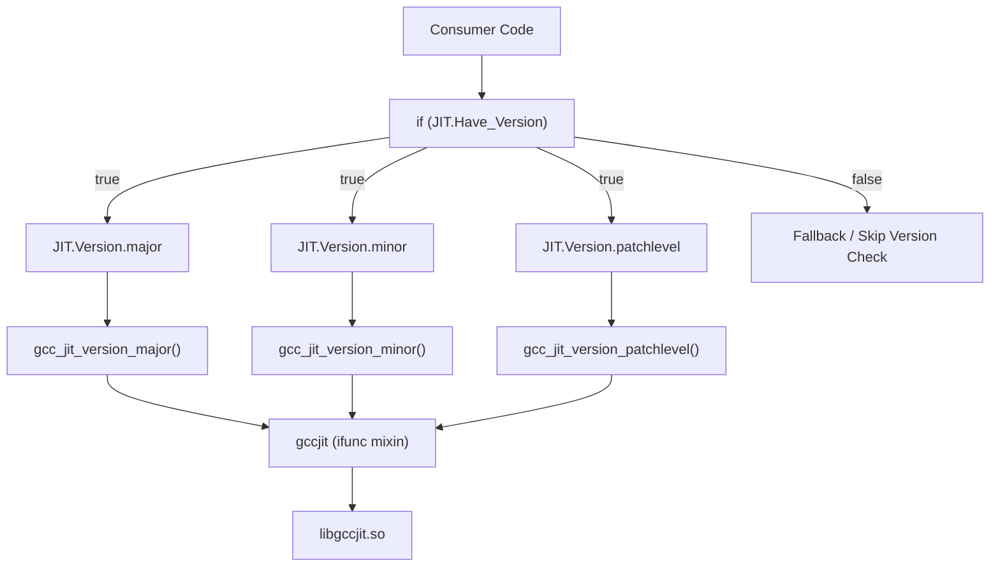
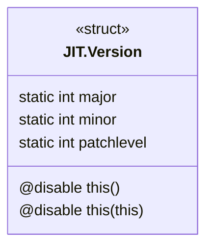

# gccjit.version_: libgccjit Version Querying

The `gccjit.version_` module provides the `JIT.Version` struct, a static, non-instantiable namespace wrapper used to query the runtime version of the loaded libgccjit library (`gcc_jit_version_major`, `gcc_jit_version_minor`, and `gcc_jit_version_patchlevel`). It is publicly exposed through the `JIT` namespace facade and guarded by the `JIT.Have_Version` feature flag.

## Version Struct Implementation

Unlike standard wrapper structs in gccjitd, `JIT.Version` does not wrap an opaque object handle, does not inherit from `JIT.Object`, and omits the standard `opCast!bool()` operator.

To prevent instantiation and copying, all constructors and copy hooks are explicitly disabled:

- `@disable this();`
- `@disable this(ref const Version);`
- `@disable this(this);`

The struct exposes three static `@property` functions marked `nothrow` and `@nogc`:

- `JIT.Version.major()`: Invokes `gcc_jit_version_major()`
- `JIT.Version.minor()`: Invokes `gcc_jit_version_minor()`
- `JIT.Version.patchlevel()`: Invokes `gcc_jit_version_patchlevel()`

## Runtime Feature Guarding via JIT.Have_Version

Because version querying entrypoints were introduced in libgccjit ABI version 13, linking against older versions of `libgccjit.so` requires checking for symbol availability before execution. The `JIT.Have_Version()` static method verifies that all required C symbols are present in the loaded library.



The feature flag `JIT.Have_Version()` is generated in `gccjit` module using the `Have` string-mixin template:
```d
static bool Have_Version()
{ mixin(Have!(["gcc_jit_version_major",
               "gcc_jit_version_minor",
               "gcc_jit_version_patchlevel"])); }
```

## Struct Layout and Properties

