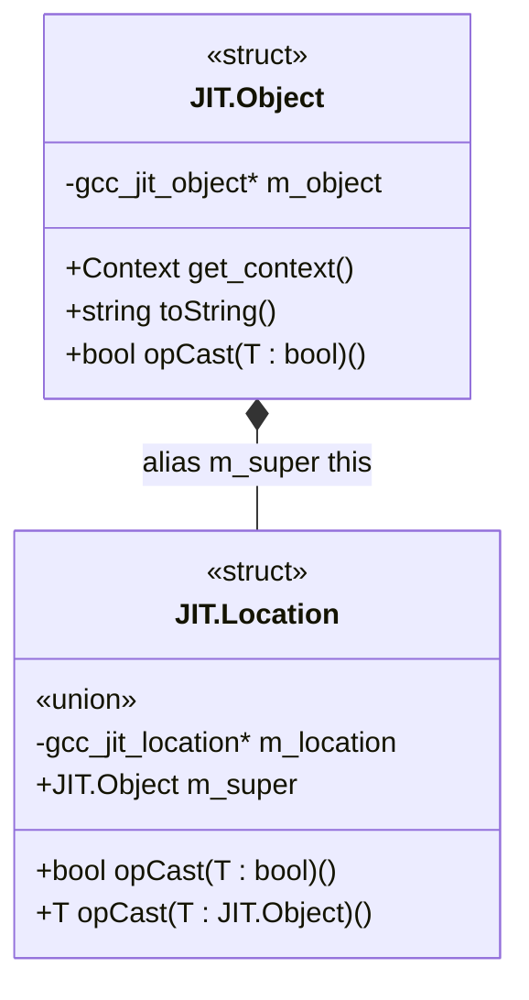

# D API Layer: Core Architecture

The D API layer serves as an idiomatic, zero-overhead wrapper built directly on top of the raw C bindings layer (`gccjit.bindings`). It abstracts raw pointers into strongly-typed D structs while preserving @nogc, nothrow, and exception-free semantics. Memory management is tied directly to the compilation context: all JIT entities are automatically cleaned up when their parent Context is released.

## Core Architectural Patterns

The wrapper design relies on a few key patterns to bridge C semantics with D idioms:

- **Struct-Based Inheritance (Union + alias this)**: Derived wrapper structs (such as `JIT.Location`) embed a union containing the raw pointer and a JIT.Object super instance, using `alias this` to enable seamless upcasting.
- **Null-Checking Convention**: Nearly every wrapper struct implements `opCast!bool` to check whether the underlying C handle is non-null.
- **Visibility Model**: Public access is regulated via `package(gccjit)` visibility rules, ensuring internal handles and constructors remain hidden from external consumers.

## Child Subsystems

For detailed descriptions of each component within the D API layer, refer to the following child pages:

### 3.1. JIT.Object: The Base Wrapper

Covers `JIT.Object`, defining the base structure for all JIT entities, the `union`/`alias this` inheritance pattern, context retrieval via `get_context()`, debugging string representation via `toString()`, the `opCast!bool` null-checking convention, and package-level visibility rules.

For details, see [JIT.Object: The Base Wrapper](3.1-base-object.md).

### 3.2. Source Locations (gccjit.location)

Documents the `JIT.Location` struct, wrapping `gcc_jit_location` to attach source code positions to JIT-generated statements and expressions. Covers creation via `JIT.Context.new_location`, the default `JIT.Location()` "no location" value, `opCast!JIT.Object` upcasting, `opCast!bool` validation, and integration with debug information configuration.

For details, see [Source Locations (gccjit.location)](3.2-source-location.md).

### 3.3. Flags and Enumerations

Documents all configuration enums defined in `gccjit.flags`, mapping directly to upstream `GCC_JIT_*` C constants, including `FunctionType`, `GlobalKind`, `CType`, `UnaryOp`, `BinaryOp`, `ComparisonOp`, `OutputKind`, `OptimizationLevel`, `TlsModel`, `FnAttribute`, and `VarAttribute`.

For details, see [Flags and Enumerations](3.3-enum-flags.md). 