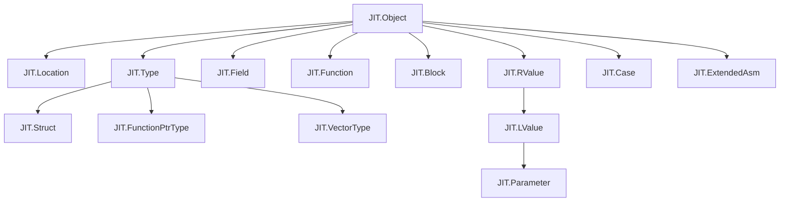
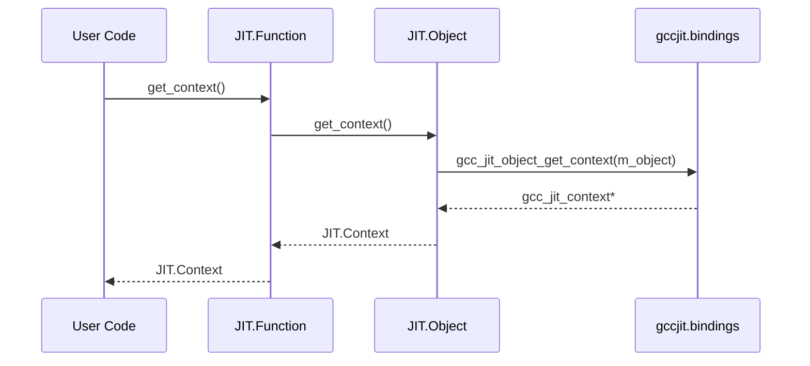

# JIT.Object: The Base Wrapper

`JIT.Object` is the foundational struct wrapper in gccjitd, serving as the base entity for almost all wrapped JIT elements in the D API.
It abstracts the underlying opaque `gcc_jit_object*` pointer from libgccjit providing core common operations such as context retrieval, debug string generation, and standard boolean evaluation.

## The Struct Hierarchy and Inheritance Pattern

In gccjitd, object wrapping relies on value semantics with structs. Although D does not support classical single inheritance for structs, wrapper types utilize encapsulation and the `alias this` pattern (along with union layouts in derived types) to model the inheritance hierarchy defined by upstream libgccjit.

The structural relationship rooted at `JIT.Object` spans source locations, types, fields, functions, basic blocks, and values.

*Figure 3.1.1: Hierarchy mapping between natural JIT concepts and gccjit struct entities.*

## Core Methods

`JIT.Object` defines three primary public methods available to all derived wrapper types.

### Context Retrieval: get_context()

The `get_context()` method queries the underlying C library to retrieve the parent `JIT.Context` instance that owns the object.
It wraps `gcc_jit_object_get_context` and returns a `JIT.Context` wrapper struct.
 
### Debug String Generation: toString()

To obtain a human-readable representation of a JIT entity for debugging and inspection, `toString()` invokes `gcc_jit_object_get_debug_string` and converts the resulting C string into a D string via helper functions.
 
### Boolean Evaluation: opCast!bool

Following the library-wide convention, `JIT.Object` implements `opCast(T : bool)` to allow idiomatic null-checking.

Derived structs inherit this operator, enabling expressions such as `if (my_function)` or `if (!rvalue)` to verify handle validity without explicitly checking against `null`.
 
## Data Flow for JIT.Object Operations
 
The following diagram illustrates how methods invoked on a derived JIT wrapper (such as `Function` or `RValue`) delegate or interface through `JIT.Object` down to the raw C bindings.
 

*Figure 3.1.2: Control and data flow during context extraction from a wrapped JIT entity.*

## Package-Level Visibility Model

The internal state of `JIT.Object`—specifically its wrapped pointer m_object and internal constructors—is hidden from public consumers using D's package visibility attribute (`package(gccjit)`).

- **m_object**: Stored as a private or package-level pointer, preventing external modification.
- **Constructors**: Package constructors (`this(gcc_jit_object* obj)`) and handle accessors (`get_object()`) are restricted to the gccjit package ensuring that users only instantiate or inspect JIT entities through official factory methods provided by `JIT.Context` or derived types.
