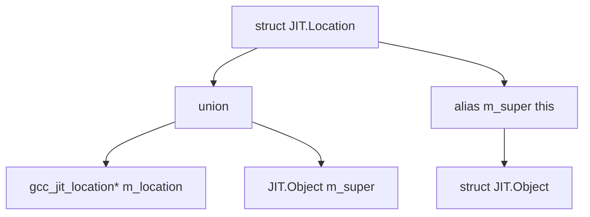
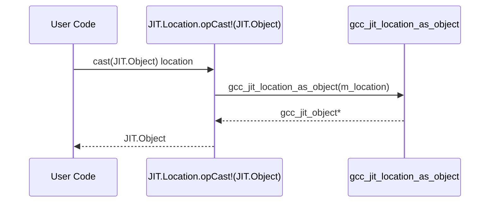

# Source Locations (gccjit.location)

## Overview and Purpose

The `gccjit.location` module provides the `JIT.Location` wrapper struct, which encapsulates libgccjit's `gcc_jit_location` opaque pointer.
`JIT.Location` instances allow developers to associate source code positions (file name, line number, and column number) with statements and expressions in JIT-compiled code.
This metadata is essential for debugger integration, stack traces, and accurate error reporting.

## The Location Struct Layout and Inheritance

Like other wrapper structs in gccjitd, `JIT.Location` uses the union-based inheritance pattern with `alias this` to bridge to the base wrapper `JIT.Object`.



*Figure 1: Natural Language to Code Entity Space mapping for the Location struct architecture.*

## Construction, Null-Checking, and Default Values

`JIT.Location` instances cannot be constructed directly by public consumer code; their constructors are marked with package visibility `package(gccjit)`.
Instead, locations are typically created via context factory methods (such as `JIT.Context.new_location`).

- **Default Value (JIT.Location())**: Initializing an unassigned `JIT.Location` via its default constructor yields a wrapper containing a null pointer. This 'no location' value is accepted safely by API statement builders across the library.
- **Null Checking (opCast!bool)**: To check whether a `JIT.Location` points to a valid C structure, `JIT.Location` implements `opCast(T : bool)`. It evaluates whether m_location is non-null. Idiomatic null-checks take the form `if (loc)` or `cast(bool)loc`.

```d
// Example idiom for null-checking a Location
JIT.Location loc = context.new_location("example.c", 10, 5);
if (loc) {
    // Location is valid
}
```

## Upcasting to JIT.Object

Because `JIT.Location` inherits from `JIT.Object` via `alias this`, methods expecting a `JIT.Object` can accept a `JIT.Location` implicitly. Explicit upcasting is also supported through an `opCast` overload specialized for `JIT.Object`.
This overload invokes the underlying C function `gcc_jit_location_as_object` to retrieve the parent object handle.



*Figure 2: Data flow during an explicit upcast from JIT.Location to JIT.Object.*

## Interaction with Debug Information (JIT.Context.set_debug_info)

Source locations are inert unless the compilation context enables debug information generation.
By invoking `JIT.Context.set_debug_info(true)`, the compiler is instructed to generate DWARF debugging records.

However, as documented in the context configuration, debuggers cannot effectively step through JIT-compiled code or inspect source variables unless explicit `JIT.Location` instances are associated with the generated blocks, statements, and expressions.