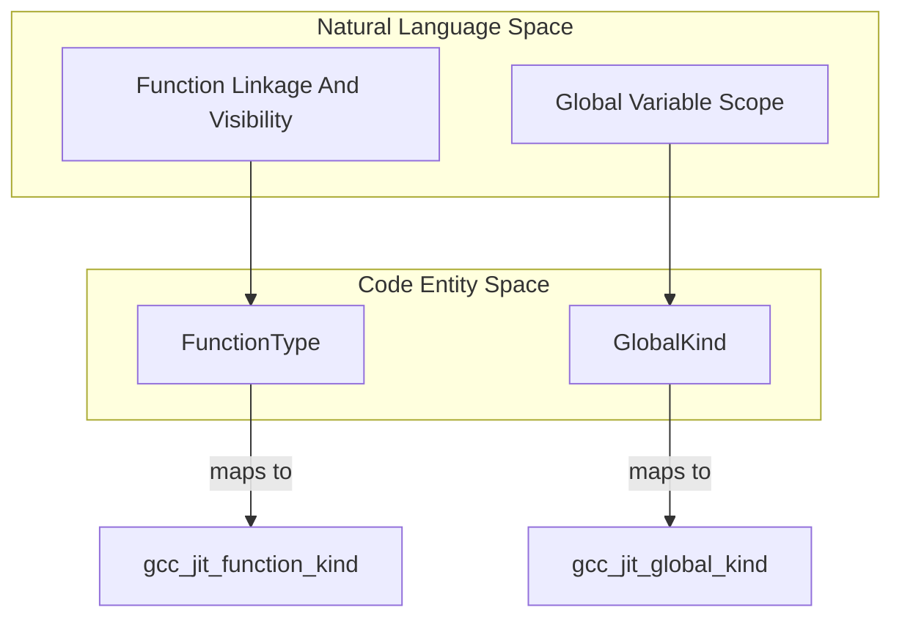
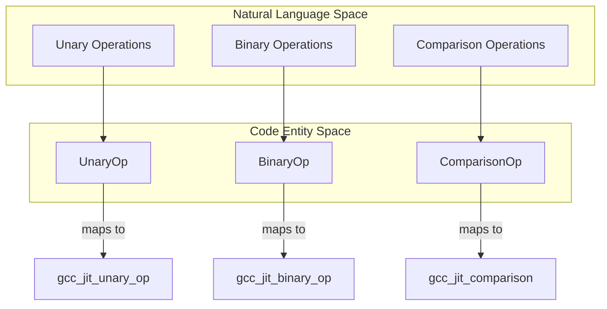

# Flags and Enumerations

The `gccjit.flags` module defines all strongly typed D enumerations that map directly to upstream libgccjit C configuration constants and enums.

These enums govern function linkage, global variable scopes, primitive C type mappings, unary, binary, and comparison operators, compilation output formats, optimization levels, thread-local storage (TLS) models, and function/variable attributes. By wrapping raw C enum values in D enums, the library ensures type safety across the D API layer without sacrificing compatibility with the underlying C runtime.

## Visibility and Linkage: FunctionType and GlobalKind

The `FunctionType` and `GlobalKind` enumerations control the linkage, visibility, and definition status of functions and global variables within a JIT compilation context.

### FunctionType

`FunctionType` mirrors `gcc_jit_function_kind`:

- `Exported`: Defined by client code and visible by name outside the JIT.
- `Internal`: Defined by client code, but invisible outside the JIT.
- `Imported`: Not defined by client code; referenced as an external entity.
- `AlwaysInline`: Inlined into other functions, invisible outside the JIT.

### GlobalKind

`GlobalKind` mirrors `gcc_jit_global_kind`:

- `Exported`: Defined by client code and visible outside the JIT context.
- `Internal`: Defined by client code, invisible outside the JIT context, analogous to a static global.
- `Imported`: Not defined by client code, analogous to an extern global.

## Standard Types: CType

The `CType` enum maps standard C, C++, and width-specific integer/floating-point types to `gcc_jit_types`:

- **Basic Types**: `Void`, `VoidPtr`, `Bool`, `Char`, `SChar`, `UChar`.
- **Integer Types**: `Short`, `UShort`, `Int`, `UInt`, `Long`, `ULong`, `LongLong`, `ULongLong`.
- **Floating-Point Types**: `Float`, `Double`, `LongDouble`.
- **Specialized & Pointer Types**: `ConstCharPtr`, `SizeT`, `FilePtr`.
- **Complex Types**: `ComplexFloat`, `ComplexDouble`, `ComplexLongDouble`.
- **Exact-Width Integers**: `Int8t`, `Int16t`, `Int32t`, `Int64t`, `Int128t`, `UInt8t`, `UInt16t`, `UInt32t`, `UInt64t`, `UInt128t`.
- **Modern Floating-Point Types**: `BFloat16`, `Float16`, `Float32`, `Float64`, `Float128`.

## Operators: UnaryOp, BinaryOp, and ComparisonOp

Operators in `gccjit.flags` define expression transformations and logical/arithmetic computations on RValue instances.

### UnaryOp

Mirrors `gcc_jit_unary_op`

- `Minus`: Negate an arithmetic value (`-(value)`).
- `BitwiseNegate`: One's complement bitwise negation (`~(value)`).
- `LogicalNegate`: Logical negation of arithmetic or pointer values (`!(value)`)

### BinaryOp and ComparisonOp

`BinaryOp` mirrors `gcc_jit_binary_op`, covering arithmetic (`Plus`, `Minus`, `Mult`, `Divide`, `Modulo`), bitwise (`BitwiseAnd`, `BitwiseXor`, `BitwiseOr`), logical (`LogicalAnd`, `LogicalOr`), and shift operations (`LShift`, `RShift`).

Comparison operations are encapsulated separately via `ComparisonOp`, mapping relational operators (e.g., equality, inequality, less than, greater than) to their corresponding C backend equivalents.

## Compilation, Optimization, and Attribute Enums

Beyond types and operators, `gccjit.flags` contains specialized configurations for compilation output, optimization passes, threading models, and code attributes:

- `OutputKind`: Specifies whether a compilation context targets an assembler file, object file, dynamic library, or executable (`GCC_JIT_OUTPUT_KIND_*`).
- `OptimizationLevel`: Sets the optimization tier (`O0`, `O1`, `O2`, `O3`) for generated code.
- `TlsModel`: Configures thread-local storage models (e.g., global dynamic, local dynamic, initial exec, local exec).
- `FnAttribute` / `VarAttribute`: Applies GNU-style attributes to functions and variables (such as alignment, section placement, visibility overrides, and calling conventions).
