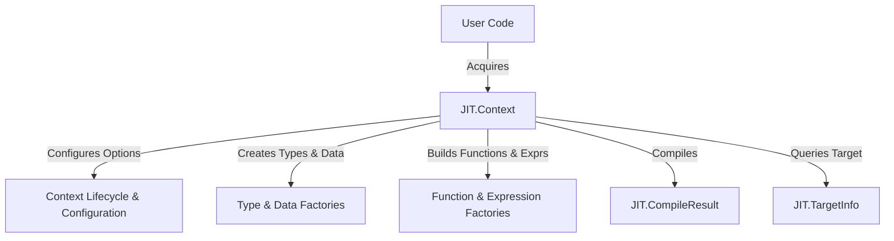

# Compilation Context (gccjit.context)

The `JIT.Context` struct serves as the central hub, factory, and lifecycle manager for all JIT-compiled entities within gccjitd. Every object—such as types, functions, basic blocks, global variables, and source locations—is created through factory methods invoked on a `JIT.Context` instance.

A `JIT.Context` encapsulates the state of a compilation and transitions between two primary phases: an Initial phase where options are configured and code is structured, and a PostCompilation phase where the context has executed a build and can output dynamic library artifacts or be released.

## 4.1. Context Lifecycle and Configuration

The lifecycle of a compilation context begins with `JIT.Context.acquire()` and concludes with `release()`.
Child contexts can be spawned using `new_child_context()` to inherit configuration settings while retaining a bounded lifetime relative to their parent.

During the initial state, consumers can configure compilation parameters such as optimization levels (`set_optimization_level`),
debug information flags (`set_debug_info`), program names (`set_program_name`), and log files (`set_logfile`).
Compilation errors can be retrieved, and reproducibility files or tree dumps can be generated directly from the context.

For full details on resource management, child contexts, and option setters, see [Context Lifecycle and Configuration](4.1-context-lifecycle.md).

## 4.2. Type and Data Factory Methods

`JIT.Context` acts as the primary factory for creating type definitions and global data items. Methods are provided to retrieve primitive types (`get_type`), parameterized integer types (`get_int_type` and the `get_int_type!T` template), array types, function signatures, and aggregate structures or unions (`new_struct_type`, `new_union_type`, `new_opaque_struct_type`).
Additionally, global variables are instantiated via factory methods like `new_global()`.

For detailed type creation APIs and struct/global definitions, see [Type and Data Factory Methods](4.2-types-data.md).

## 4.3. Function, Expression, and Operator Factory Methods

Beyond types, the compilation context provides extensive factory methods for constructing executable code structures. This includes creating functions (`new_function`), parameters (`new_param`), and built-in function bindings (`get_builtin_function`).
Expressions, type casts, array accesses, and arithmetic/logical operators (`new_unary_op`, `new_binary_op`, `new_comparison`) are generated directly via context methods.

For a complete breakdown of function construction, expression generation, and operator overloads, see [Function, Expression, and Operator Factory Methods](4.3-functions-expressions.md).

## 4.4. Compilation Output: CompileResult

Once a context has been populated with types, variables, and control flow, invoking `compile()` or `compile_to_file()` transitions the context to produce compilation results.
The compilation process returns a `JIT.CompileResult` struct, which wraps the underlying `gcc_jit_result` object. `JIT.CompileResult` exposes mechanisms to load compiled machine code pointers via `get_code()` and global variables via `get_global()`, as well as releasing the loaded library via `release()`.

For details on loading symbols from compiled outputs and managing result lifecycles, see [Compilation Output: CompileResult](4.4-compilation-output.md).

## 4.5. Target Information Queries (gccjit.target)

A `JIT.Context` can query target-specific hardware and architecture parameters through `get_target_info()`, which returns a `JIT.TargetInfo` wrapper. This structure enables capabilities checks such as verifying instruction set support via `cpu_supports(string feature)`, querying target architecture names via arch(), and checking native support for specialized C types via `supports_type(CType type)`. This API is introduced in libgccjit ABI version 35 and is conditionally compiled using `JIT.Have_TargetInfo_API`.

For target querying patterns and feature flags, see [Target Information Queries (gccjit.target)](4.5-target-info.md).