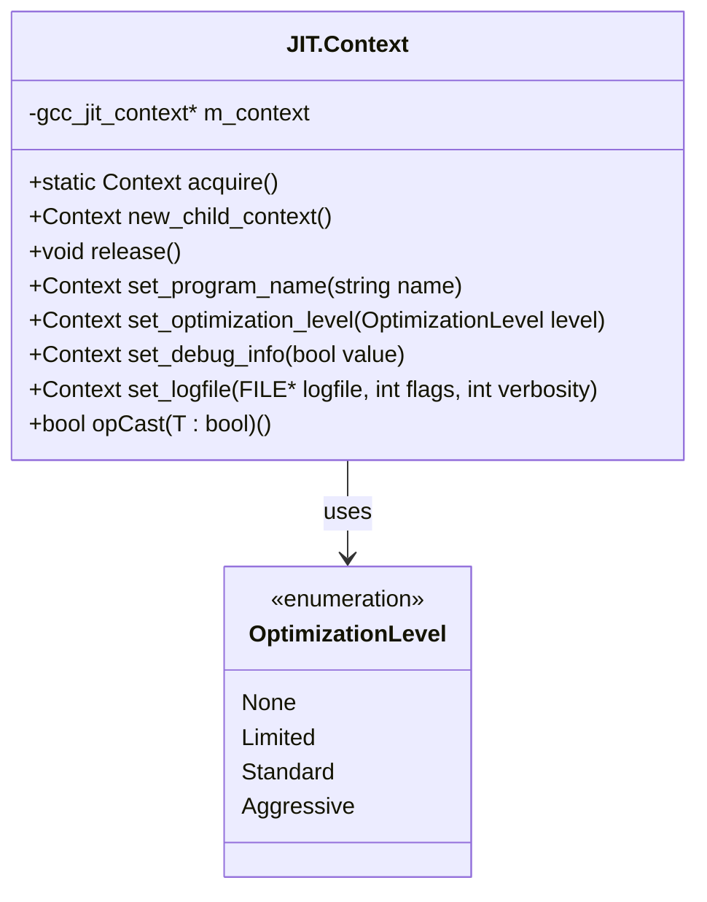

# Context Lifecycle and Configuration

This page documents the lifecycle management and configuration properties of the `JIT.Context` struct, which serves as the central factory and state container for JIT compilation operations in gccjitd.

## 1. Context Lifecycle: Acquisition, Child Contexts, and Release

A `JIT.Context` instance encapsulates the state of a compilation and transitions between two primary states:

1. **Initial State**: The context is active; options can be configured, and types, functions, and basic blocks can be constructed.
2. **Post-Compilation State**: Entered after invoking compilation (`compile()` or `compile_to_file()`), after which no further modifications can be made, and the context must eventually be released.

The core lifecycle methods implemented are:

- `Context.acquire()`: Acquires a top-level compilation context by wrapping `gcc_jit_context_acquire()`
- `Context.new_child_context()`: Creates a child context that inherits all option settings from the parent. Objects created in the parent can be referenced by the child, but not vice-versa. The child context must be released before its parent
- `Context.release()`: Releases the underlying `gcc_jit_context` and invalidates the wrapper handle
- `opCast(T : bool)`: Allows idiomatic null-checking (`if (ctx)`) by verifying that the internal `m_context` pointer is non-null

## 2. Configuration Properties and Options

`JIT.Context` provides a fluent interface for setting compilation options, where configuration methods return `JIT.Context` by reference to allow method chaining.

- **Program Name**: `set_program_name(string name)` sets the program prefix used when printing error messages to stderr (`GCC_JIT_STR_OPTION_PROGNAME`)
- **Optimization Level**: `set_optimization_level(OptimizationLevel level)` configures optimization tiers (`-O0` through `-O3`, mapping to `GCC_JIT_INT_OPTION_OPTIMIZATION_LEVEL`)
- **Debug Information**: `set_debug_info(bool value)` enables generation of debug symbols (`GCC_JIT_BOOL_OPTION_DEBUGINFO`) so debuggers can inspect variables and step through JIT code when paired with `JIT.Location` instances.
- **Log Files**: `set_logfile(FILE* logfile, int flags, int verbosity)` directs internal compiler logs to a specified C `FILE*` stream

## 3. Compiler and Driver Command-Line Options

`JIT.Context` interacts with underlying driver options to pass arbitrary flags directly to the GNU assembler, linker, or preprocessor. These methods append command-line options (`add_command_line_option`) or driver-specific arguments (`add_driver_option`) to customize the build pipeline.

## 4. Error Handling and Diagnostic Retrieval

Errors encountered during context configuration or code generation do not throw D exceptions (due to `-betterC` and `@nogc` constraints across the library). Instead, errors are recorded internally within the `gcc_jit_context` structure.

Developers can retrieve the first encountered error string using internal bindings or helper mechanisms associated with the context, allowing safe inspection of compilation failures without unwinding stack frames.

## 5. Dump and Debug Options

To assist with compiler debugging and introspection, Context supplies several dump utilities:

- `dump_to_file(string path, bool update_locations)`: Dumps a C-like representation of the current context state to disk
- `dump_reproducer(string path)`: Generates a C source reproducer file that programmatically reconstructs the exact context state
- `set_dump_initial_tree(bool value)`: Dumps the initial tree representation to stderr prior to optimizations
