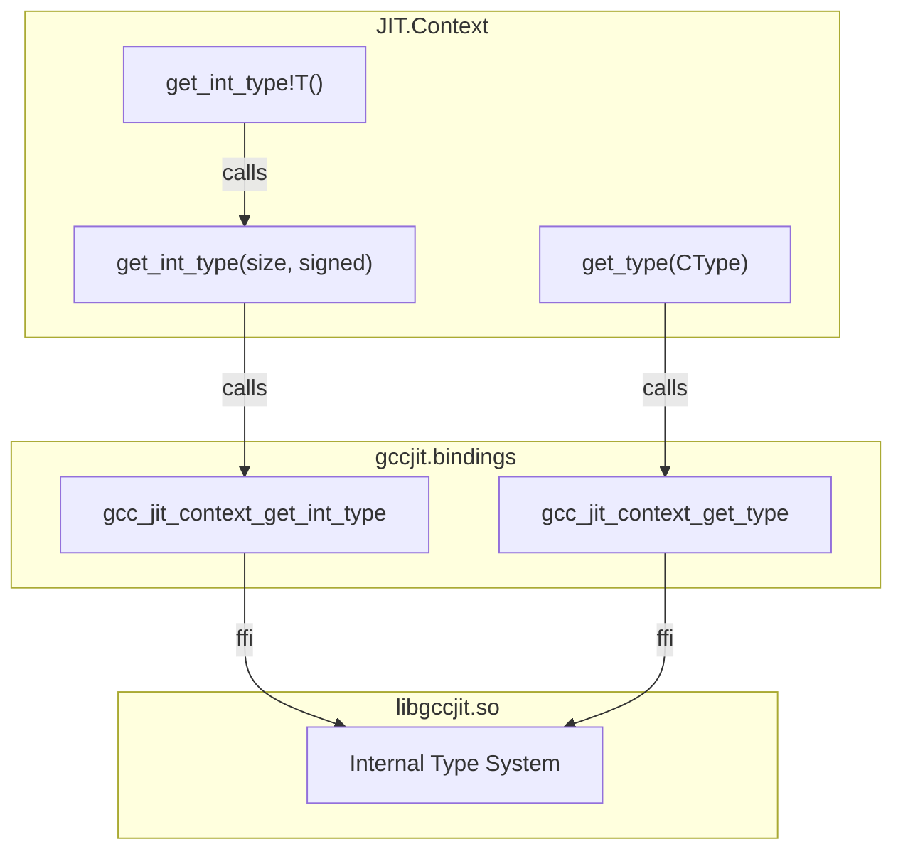
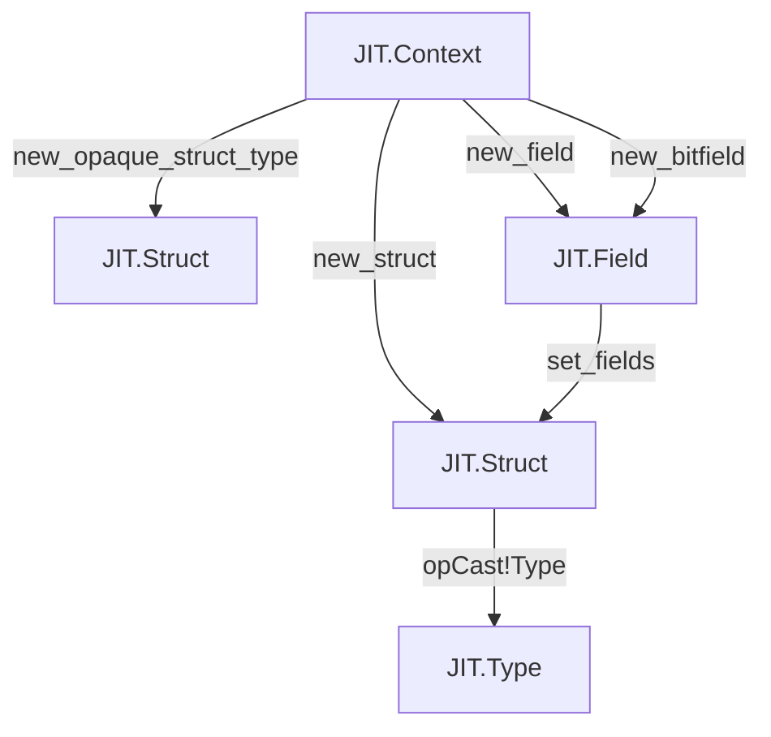
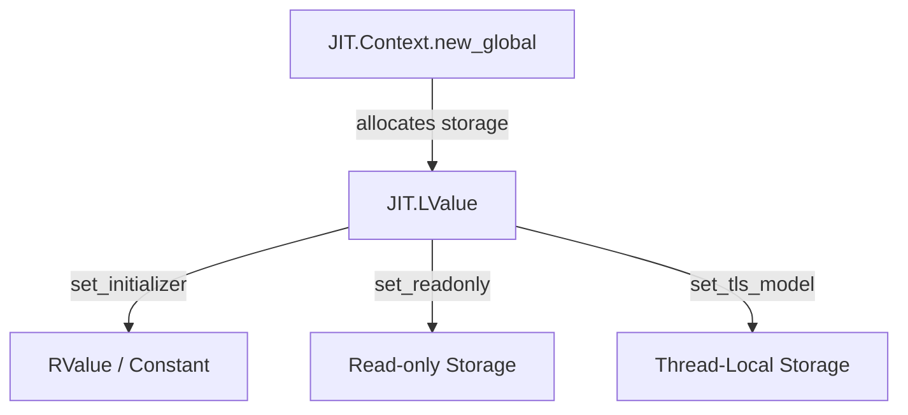

# Type and Data Factory Methods

The `JIT.Context` struct serves as the central factory and lifecycle manager for all JIT-compiled entities, including fundamental types, derived types, aggregate structures, and global variables. This page details the methods provided by `JIT.Context` for constructing type representations and data declarations before compilation.

## Fundamental and Derived Type Factories

Type creation in gccjitd begins with fundamental types retrieved from the compilation context and extends to derived types (pointers, arrays, function pointers, and const/volatile/restrict modifiers) handled via `JIT.Type` methods.

### Fundamental Types via get_type

Fundamental types (such as integers, floats, void, and boolean types) are instantiated by querying the context using enumerators defined in `gccjit.flags` (mapped from `enum CType`).

### The get_int_type!T D Template

To bridge D's native integer types (`int`, `long`, `short`, `byte`, etc.) with libgccjit's C-based type system, gccjitd provides the `get_int_type!T` template. This inspects the size and signedness of the D template parameter T at compile time and requests the corresponding integer type from the underlying C context.

### Derived Array and Function Types

- **Array Types**: `new_array_type(Location loc, Type element_type, int num_elements)` constructs fixed-size array types.
- **Function Types**: `new_function_type(Location loc, Type return_type, Type[] param_types, bool is_variadic)` creates function signature types used for function pointers and indirect calls.

## Aggregate Types: Structs, Unions, and Fields

Aggregate types allow the definition of composite data structures. gccjitd represents these through Struct and Field wrapper structs.

### Struct and Union Creation

- `new_struct_type(Location loc, string name, Field[] fields)` defines a complete structure type with known fields.
- `new_union_type(Location loc, string name, Field[] fields)` defines a union type where all fields share the same memory location.
- `new_opaque_struct_type(Location loc, string name)` creates a forward-declared, opaque structure type, enabling self-referential data structures (such as linked lists or trees) before their full layouts are known.

### Field and Bitfield Allocation

Fields within aggregate types are constructed using dedicated factory methods:

- `new_field(Location loc, Type type, string name)` creates a standard struct or union member.
- `new_bitfield(Location loc, Type type, int width, string name)` creates a bitfield member with a constrained bit-width.

## Global Variable Factory (new_global)

Global variables are declared on the compilation context using `new_global`. This method returns a `JIT.LValue`, representing an assignable storage location that can be referenced across functions within the same JIT context.

Parameters for global creation typically include:

- A source `JIT.Location` for debugging and error reporting.
- A `GlobalKind` specifier (e.g., exported, internal, or imported linkage).
- The `JIT.Type` of the global variable.
- The `string` name of the variable.

Once created, the returned `JIT.LValue` can be configured further using methods such as `set_initializer`, `set_readonly`, `set_alignment`, or `set_tls_model`.

