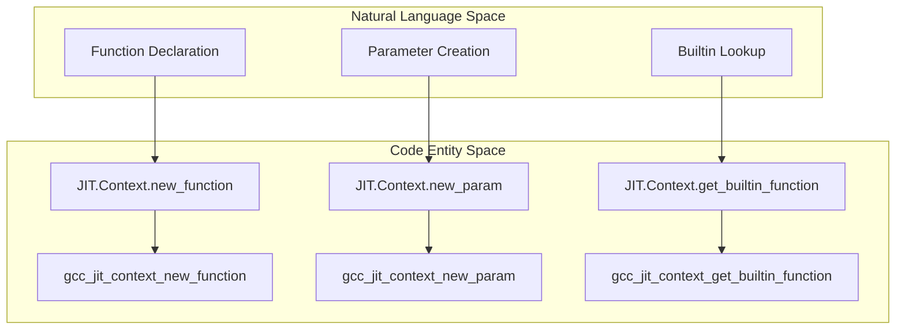
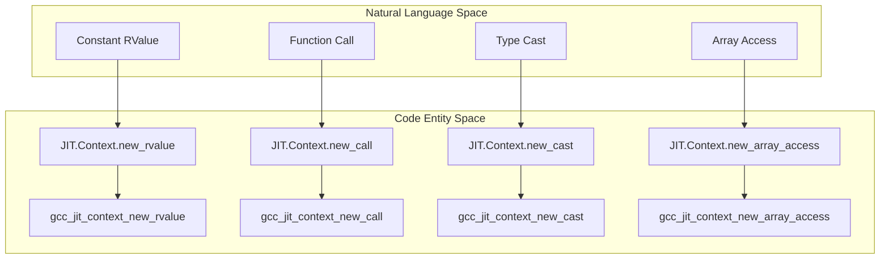

# Function, Expression, and Operator Factory Methods

This page documents the `JIT.Context` factory methods responsible for instantiating executable code constructs within gccjitd. Specifically, it covers function and parameter declarations (`new_function`, `new_param`, `get_builtin_function`), expression builders (   `new_rvalue_*`, `new_call`, `new_cast`, `new_array_access`, constructors, `sizeof`/`alignof`), operator factories (`new_unary_op`, `new_binary_op`, `new_comparison`), and vector operations. As part of the gccjit.context module these methods leverage the compilation context as the central factory for all JIT entities.

## Function and Parameter Factory Methods

The compilation context provides methods to declare functions, function parameters, and access compiler built-ins. These declarations form the skeleton of any compiled module before basic blocks and statements are attached.

- `new_function`: Allocates a new `JIT.Function` object within the context, specifying source location, function type (`FunctionType`), return type (`JIT.Type`), parameter array, and variadic flags. This maps directly to underlying libgccjit function creation routines.
- `new_param`: Creates a `JIT.Parameter` object associated with a specific type and name, representing a function parameter
- `get_builtin_function`: Looks up and returns a compiler built-in function by its string identifier (e.g., standard library intrinsics or compiler builtins like `__builtin_sin`).

## Expression Factory Methods

Expressions (`JIT.RValue` and `JIT.LValue`) are constructed via factory methods on `JIT.Context`. These methods wrap intermediate representation nodes that compute values or reference storage locations.

### Key Expression Builders

- `new_rvalue_*`: Methods to construct constant rvalues from primitive D types (integers, floating-point numbers, booleans, and pointers).
- `new_call`: Constructs a function call expression (`JIT.RValue`) given a target Function or function pointer `JIT.RValue`, along with an array of argument rvalues. Optionally supports tail-call optimizations via `set_require_tail_call`
- `new_cast`: Converts an `JIT.RValue` from its current type to a target `JIT.Type`
- `new_array_access`: Creates an array indexing expression, equivalent to pointer arithmetic and dereference `ptr[index]`
- **Constructors**: Array and struct constructors (`new_array_constructor`, `new_struct_constructor`) allow aggregate initialization inline.
- **Size and Alignment**: Queries for the size and alignment of types or rvalues (`sizeof`, `alignof` equivalents).

## Operator Factory Methods

Arithmetic, bitwise, logical, and relational operations are produced through explicit operator factory methods on `JIT.Context`. These methods accept operator enumeration flags defined in `gccjit.flags` and return new `JIT.RValue` expressions representing the result.

### Operator Categories

- **Unary Operators (**`new_unary_op`**)**: Applies unary operations (such as logical negation `!`, bitwise complement `~`, or unary minus `-`) governed by `UnaryOp` flags
- **Binary Operators (**`new_binary_op`**)**: Applies binary arithmetic and bitwise operations (`+`, `-`, `*`, `/`, `%`, `&`, `^`, `|`, `<<`, `>>`) governed by `BinaryOp` flags
- **Comparisons (**`new_comparison`**)**: Evaluates relational comparisons (`==`, `!=`, `<`, `<=`, `>`, `>=`) between two rvalues using `ComparisonOp` flags.

Note that gccjitd also implements D operator overloads directly on `JIT.RValue` (e.g., `opBinary`, `opUnary`, `opIndex`), which forward internally to these exact `JIT.Context` operator factories.

## Vector Operations

For SIMD and vector processing, `JIT.Context` provides specialized vector operation factories that operate on `JIT.VectorType` instances. These include:

- Vector constructors that build vectors from element arrays.
- Vector-specific binary and unary operations mapping to hardware SIMD instructions.
- Element extraction and insertion routines.

Vector types are derived from base scalar types using `JIT.Type.get_vector(...)`, and subsequent manipulations utilize standard expression factories adapted for vector registers.