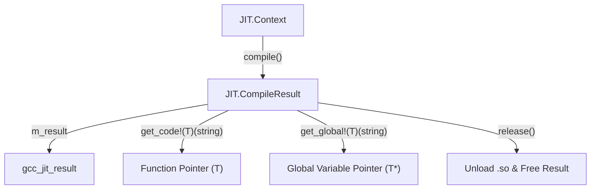
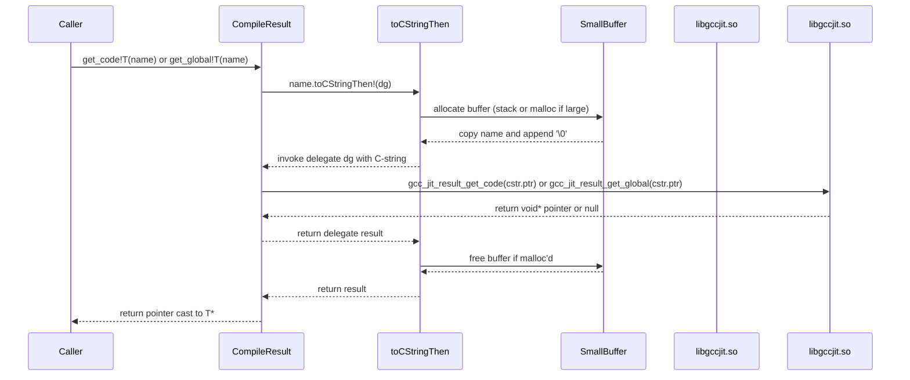

# Compilation Output: CompileResult

The `JIT.CompileResult` struct represents the output of an in-memory JIT compilation performed by a `JIT.Context`. It wraps the raw libgccjit `gcc_jit_result` pointer and provides type-safe accessors for retrieving compiled functions and exported global variables, as well as lifecycle management for unloading the generated shared library `.so` file from memory.

## 1. Struct Overview and Context Integration

The `JIT.CompileResult` struct is instantiated exclusively by `JIT.Context.compile()`

*Figure 1: Compilation lifecycle bridging JIT.Context execution to JIT.CompileResult pointer retrieval.*

## 2. Lifecycle and Null-Checking Methods

`JIT.CompileResult` follows the standard null-checking and resource management pattern used throughout gccjitd:

- `opCast!bool`: Enables idiomatic null-checks (e.g., `if (result)`). It checks whether the underlying `m_result` pointer is non-null
- `release()`: Unloads the underlying JIT-compiled shared library and frees the `gcc_jit_result` resource. After calling `release()`, the `JIT.CompileResult` instance must not be used further, and any function or global pointers retrieved from it become invalid.

## 3. Symbol Retrieval: get_code and get_global

To extract executable entry points and exported variables from the compilation result, `JIT.CompileResult` provides two template methods that wrap libgccjit lookup functions using helper string conversion facilities (`toCStringThen`)

*Figure 2: Sequence of operations for symbol lookup via get_code and get_global.*

### get_code

Locates a compiled function within the generated machine code by its symbol name

- **Template Constraints**: Enforces that `T` is a pointer to a function type (`if (is(T U : U*) && is(U == function))`)
- **Behavior**: Returns a typed function pointer, or null if the symbol cannot be found

### get_global

Locates an exported global variable within the compiled code

- **Prerequisite**: The global variable must have been created using `GlobalKind.EXPORTED` during context setup.
- **Template Constraints**: Constrained on any valid type `T` (`if (is(T))`)
- **Behavior**: Returns a pointer (`T*`) to the global variable storage 