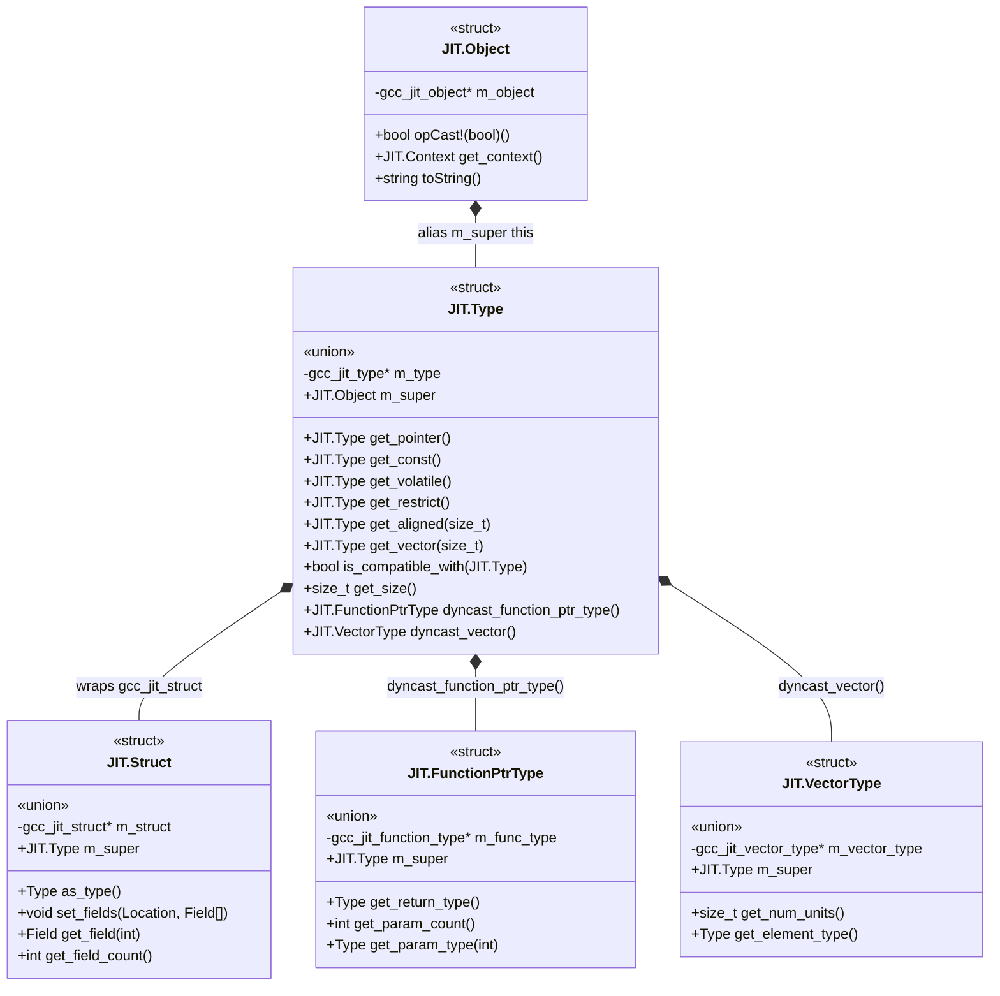
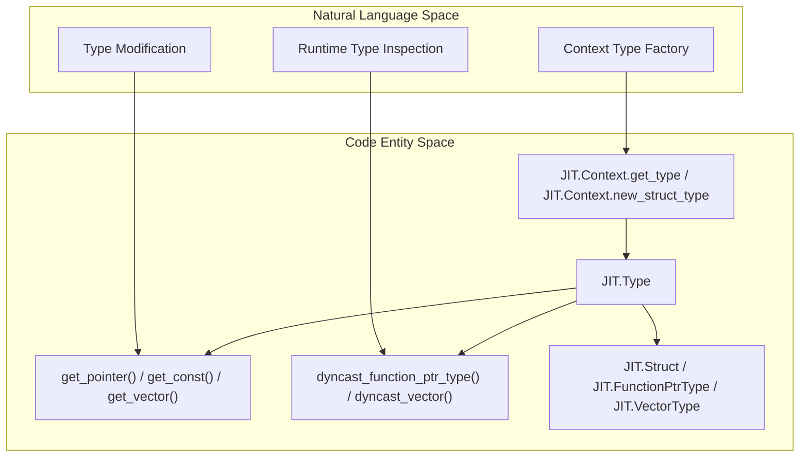

# Type System (gccjit.types)

The type system in gccjitd provides a robust, D-idiomatic wrapper layer over libgccjit's type representation (`gcc_jit_type*`).
At the center of this subsystem is the Type struct, which serves as the foundational representation for all data types—ranging from fundamental primitives (integers, floats, booleans) to complex derived and aggregate structures such as pointers, arrays, vectors, function pointers, and user-defined structs.

Types are generally instantiated and managed via compilation context factory methods, then manipulated or derived using methods defined on `JIT.Type` itself.
Every type wrapper struct implements the standard `opCast!bool` convention (returning whether the underlying C pointer is non-null) and supports safe upcasting to `JIT.Object` as well as dynamic downcasting to specialized type categories.

## Base Type and Derived Types

The `JIT.Type` struct encapsulates fundamental and derived type modifiers.
Consumers can create pointer types (`get_pointer`), qualified variants (`get_const`, `get_volatile`, `get_restrict`), alignment attributes (`get_aligned`), and vector modifications (`get_vector`).

Additionally, runtime reflection and compatibility queries—such as `is_compatible_with`, `get_size`, `dyncast_array`, `is_bool`, `is_integral`, and `get_pointee`—allow inspection of type layouts and properties.
Dynamic downcasting methods (`dyncast_function_ptr_type`, `dyncast_vector`) enable safe conversion from generic `JIT.Type` instances into specialized concrete types when supported by the underlying libgccjit version (guarded by `JIT.Have_Reflection`)

For details, see [Base Type and Derived Types](5.1-base-derived.md).

## Aggregate and Specialized Types: Struct, FunctionPtrType, VectorType

Beyond basic and derived scalar types, gccjitd models compound data structures and specialized type categories through dedicated wrapper structs:

- `JIT.Struct`: Represents user-defined record types. It allows field configuration via `set_fields`, field inspection via `get_field` and `get_field_count`, and supports the opaque struct pattern (`JIT.Context.new_opaque_struct`) essential for forward declarations and self-referential data structures
- `JIT.FunctionPtrType`: Represents function pointer signatures, providing methods to query return types and parameter lists (`get_return_type`, `get_param_count`, `get_param_type`)
- `JIT.VectorType`: Represents SIMD vector types, exposing unit counts and element types (`get_num_units`, `get_element_type`)

For details, see [Aggregate and Specialized Types: Struct, FunctionPtrType, VectorType](5.2-user-defined.md).