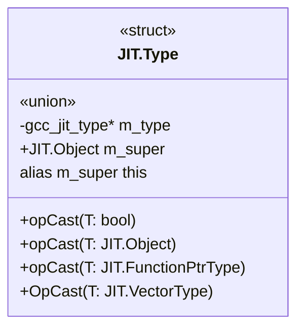
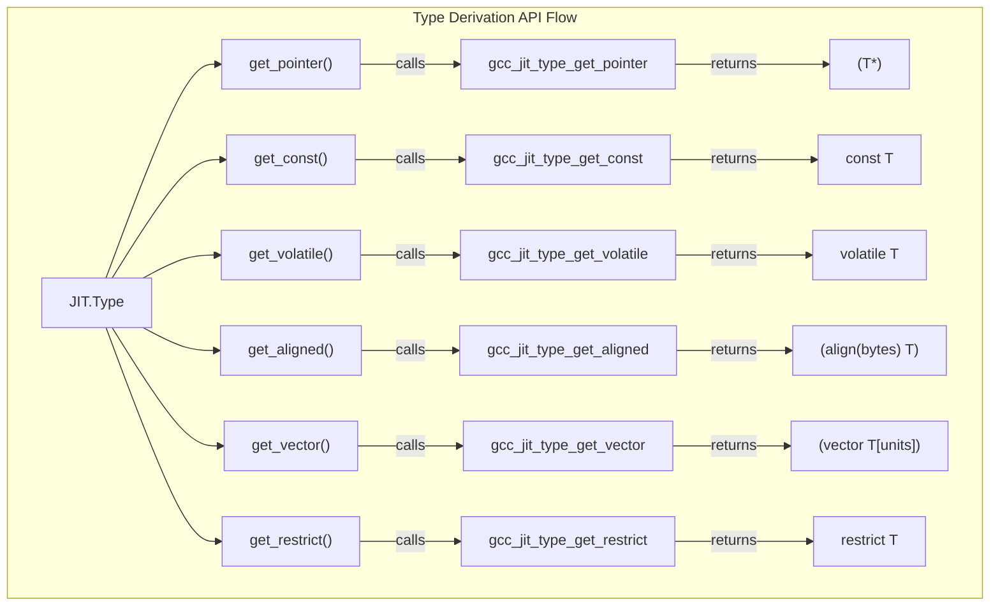

# Base Type and Derived Types

## Purpose and Scope

This page documents the `JIT.Type` struct, which serves as the core representation for data types within the gccjitd D API layer. It covers type derivation methods (`get_pointer`, `get_const`, `get_volatile`, `get_restrict`, `get_aligned`, `get_vector`), type inspection and sizing (`is_compatible_with`, `get_size`), and dynamic casting and reflection queries (`dyncast_*`, `is_*`). Every feature is discussed with respect to its underlying C bindings, ABI version requirements, and feature flag gating (`Have_*`).

## Core Data Structure and Inheritance

The `JIT.Type` struct uses the standard library pattern of a anonymous union containing a raw C pointer (`m_type`) alongside the parent `JIT.Object` (`m_super`), enabled via `alias m_super this`. This allows any `JIT.Type` instance to be implicitly treated as a `JIT.Object`.

### Type Struct Layout & Casting Architecture

- **Null Checking**: Implements `bool opCast(T : bool)() const nothrow @nogc` which evaluates whether `m_type !is null`
- **Upcasting**: Overloads `opCast(T)() const nothrow @nogc` for `JIT.Object` using `gcc_jit_type_as_object`
- **Downcasting**: Overloads `opCast(T)()` for `JIT.FunctionPtrType` and `JIT.VectorType` using `gcc_jit_type_dyncast_function_ptr_type` and `gcc_jit_type_dyncast_vector` respectively (gated by `JIT.Have_Reflection`)

## Type Derivation Methods

`JIT.Type` provides factory methods to derive modified or composite types from an existing base type. Several of these methods require specific ABI versions and must be verified using `Have_*` flags before invocation.

| Method Name | Return Type | Underlying C Function | Feature Flag Guard | Description |
|-------------|-------------|-----------------------|--------------------|-------------|
 get_pointer() | JIT.Type | gcc_jit_type_get_pointer | Unconditional | Derives pointer type T* |
| get_const() | JIT.Type | gcc_jit_type_get_const | Unconditional | Derives const T |
| get_volatile() | JIT.Type | gcc_jit_type_get_volatile | Unconditional | Derives volatile T |
| get_aligned(size_t) | JIT.Type | gcc_jit_type_get_aligned | JIT.Have_Type_get_aligned | Derives aligned type attribute |
| get_vector(size_t) | JIT.Type | gcc_jit_type_get_vector | JIT.Have_Type_get_vector | Derives vector type attribute |
| get_restrict() | JIT.Type | gcc_jit_type_get_restrict | JIT.Have_Type_get_restrict | Derives restrict T |

## Compatibility, Size, and Reflection Methods

Reflection and sizing operations inspect type structures at runtime. Added primarily in libgccjit ABI versions 16 and 20, these query methods are guarded by `JIT.Have_Reflection` and `JIT.Have_Sized_Integers`.

- **Compatibility and Size**:
    - `is_compatible_with(Type type)`: Calls `gcc_jit_compatible_types` to verify type compatibility (ABI 20, `JIT.Have_Sized_Integers`)
    - `get_size()`: Calls `gcc_jit_type_get_size` to return byte size (ABI 20, `JIT.Have_Sized_Integers`)
- **Reflection and Dynamic Casting**:
    - `dyncast_array()`: Returns element `JIT.Type` if array, else null type (ABI 16, `JIT.Have_Reflection`)
    - `is_bool()`: Returns true if type is boolean (ABI 16, `JIT.Have_Reflection`)
    - `dyncast_function_ptr_type()`: Returns `JIT.FunctionPtrType` if applicable (ABI 16, `JIT.Have_Reflection`)
    - `is_integral()`: Returns true if type is integral (ABI 16, `JIT.Have_Reflection`)
    - `get_pointee()`: Returns pointed-to `JIT.Type` if pointer (ABI 16, `JIT.Have_Reflection`)
    - `dyncast_vector()`: Returns `JIT.VectorType` if vector (ABI 16, `JIT.Have_Reflection`)
