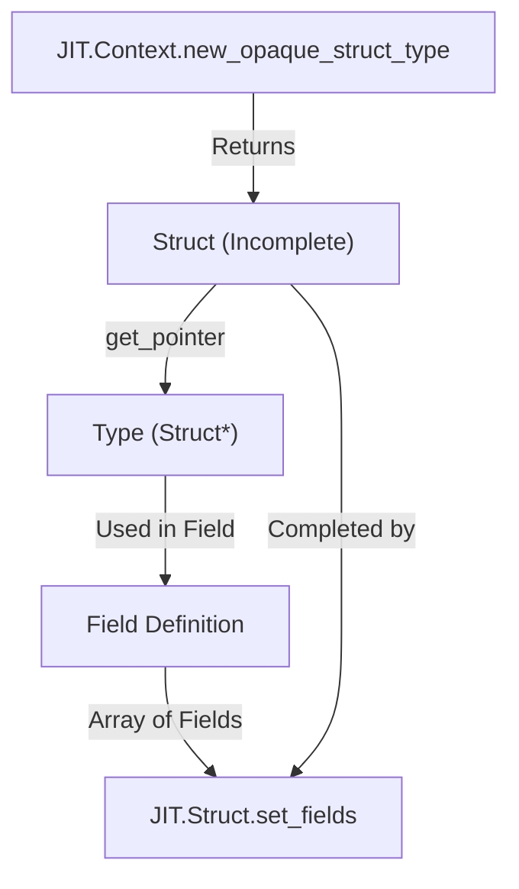
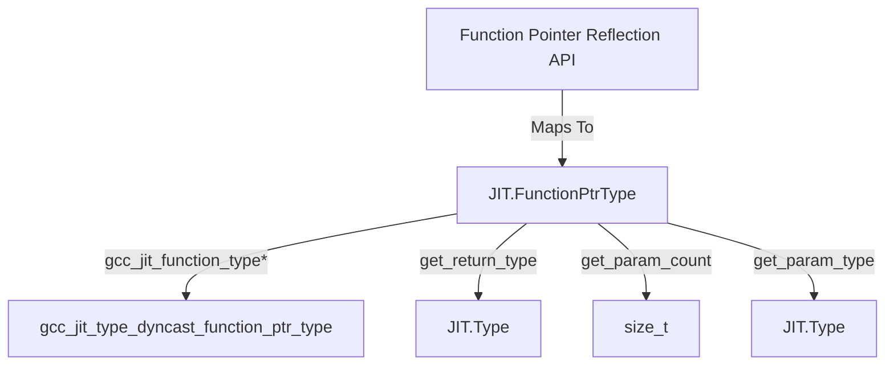
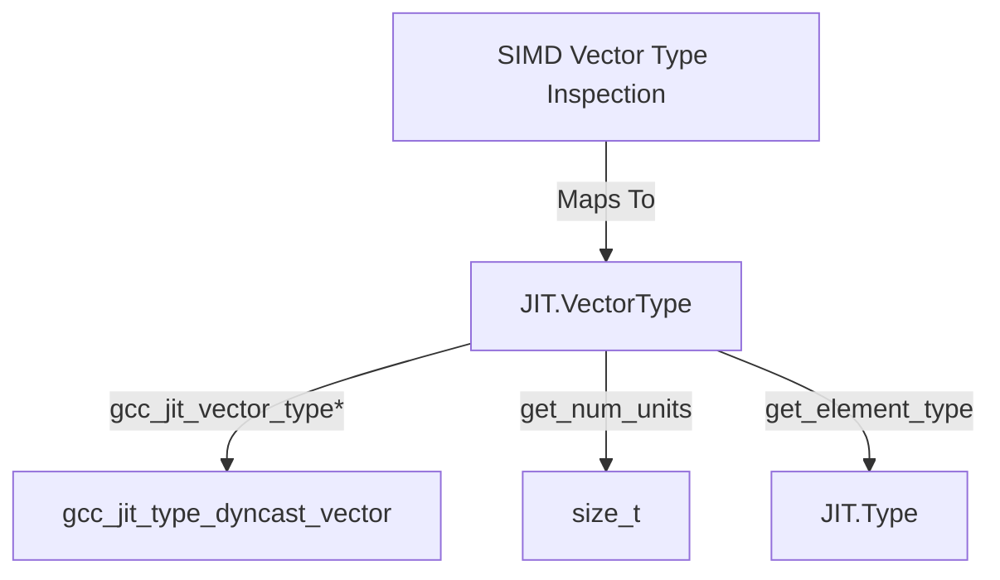

# Aggregate and Specialized Types: Struct, FunctionPtrType, VectorType

This page details the specialized and aggregate type wrappers: `JIT.Struct`, `JIT.FunctionPtrType`, and `JIT.VectorType`.
These structs extend the base type system (`JIT.Type`) to support composite data layouts, function pointers, and SIMD vector operations. All wrapper structs implement the standard idiom of `bool opCast(T : bool)() const nothrow @nogc` to check for non-null underlying C handles.

## The Struct Type and Field Layouts

The `JIT.Struct` struct represents composite data types (structs and unions) within the JIT compilation context. It encapsulates a raw `gcc_jit_struct*` pointer alongside a `JIT.Type` or `JIT.Object` super representation using a union and `alias this` inheritance pattern.

### Key Methods and Operations

- `set_fields(Location loc, scope Field[] fields)`: Defines or completes the fields of a structure type.
- `get_field(int index)`: Retrieves a specific field by its integer index.
- `get_field_count()`: Returns the total number of fields defined in the structure.
- `opCast!bool()`: Returns true if the underlying C struct pointer is non-null.
- `opCast!Type()` / `opCast!JIT.Object()`: Upcasts the `JIT.Struct` instance to its generalized base types.

### The Opaque Struct Pattern

When building self-referential data structures (such as linked lists or trees where a struct contains a pointer to itself), direct field definition in a single step is impossible because the struct type is incomplete at the time the pointer field is created. GCC JIT solves this via the opaque struct pattern:

1. Create an opaque structure forward declaration using `JIT.Context.new_opaque_struct_type`.
2. Obtain a pointer to this opaque struct using `JIT.Struct.get_pointer()`.
3. Construct field definitions referencing this pointer type.
4. Populate the structure's complete layout using `JIT.Struct.set_fields()`.

*Figure 1: Opaque Struct Construction Flow*

## Function Pointer Reflection

`JIT.FunctionPtrType` represents function pointer types within the JIT type system. It allows inspection of function signatures when reflection capabilities are enabled (`JIT.Have_Reflection`, added in libgccjit ABI version 16).

### Key Methods

- `get_return_type()`: Returns the return `JIT.Type` of the function pointer signature.
- `get_param_count()`: Returns the number of parameters accepted by the function pointer.
- `get_param_type(size_t index)`: Retrieves the `JIT.Type` of a specific parameter by its index.
- `opCast!bool()`: Validates the underlying handle.

*Figure 2: Natural Language to Code Entity Space for JIT.FunctionPtrType*

## VectorType: SIMD Vector Types

`JIT.VectorType` wraps vector (SIMD) types derived from fundamental types via `JIT.Type.get_vector(size_t num_units)`. It exposes introspection methods gated by the reflection API (`JIT.Have_Reflection`, added in libgccjit ABI version 16).

### Key Methods

- `get_num_units()`: Returns the number of vector elements (units) contained in the vector type.
- `get_element_type()`: Returns the base Type of the elements comprising the vector.
- `opCast!bool()`: Null-check operator overload.

*Figure 3: Natural Language to Code Entity Space for JIT.VectorType*