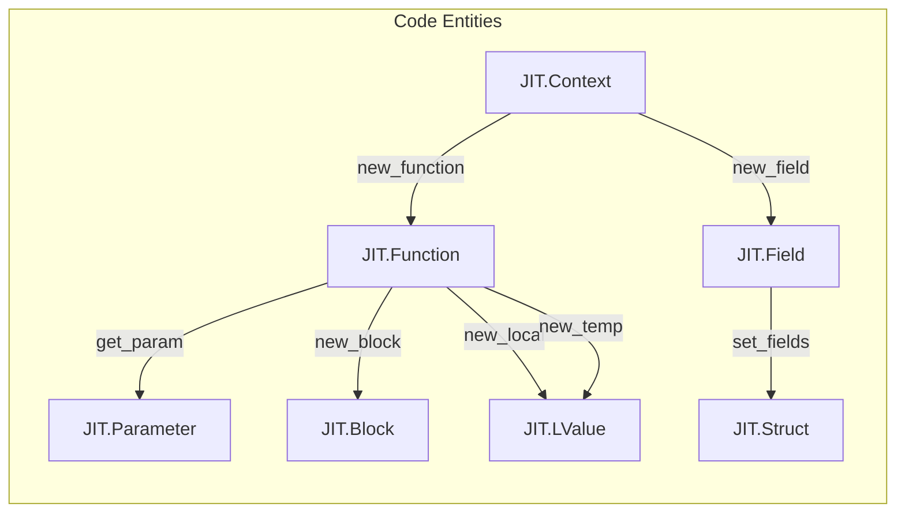
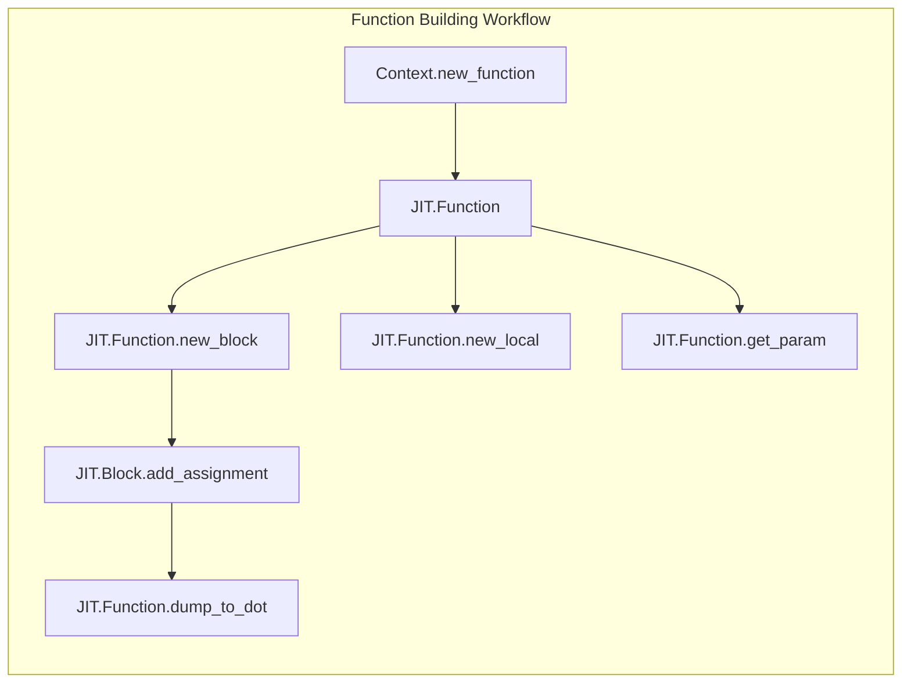

# Declarations: Functions, Parameters, and Fields

## Purpose and Scope

gccjit provides D wrapper structs for JIT declarations: `JIT.Field`, `JIT.Function`, and `JIT.Parameter`.
These wrappers inherit from `JIT.Object` using the standard union and `alias this` pattern, supporting safe downcasting and the idiomatic `opCast!bool` null-checking convention.

This page provides a high-level overview of how declarations are structured and managed within the compilation context. For granular details on methods, attributes, and struct field layouts, refer to the child pages:

- [Function and Parameter Structs](6.1-function-parameters.md)
- [Field Struct and Struct Layout](6.2-fields.md)

## High-Level Overview of Declarations

Declarations represent entities that have names, types, and scopes within a compilation context. They serve as the building blocks for constructing functions, parameters, and compound types (such as structs and unions).

## Function Definition Workflow

Defining a function in gccjitd follows a structured workflow:

1. **Creation**: A `JIT.Function` is created via the compilation context, specifying its linkage type, name, return type, and parameter list.
2. **Parameters & Locals**: Parameters are accessed via index, and local variables or temporary variables are allocated within the function scope.
3. **Control Flow**: Basic blocks (`JIT.Block`) are added to the function to form the control flow graph.
4. **Attributes & Debugging**: Optional attributes can be attached to the function, and intermediate representations can be dumped to DOT files for inspection.

## Sub-Modules and Child Pages

- [Function and Parameter Structs](6.1-function-parameters.md): Covers Function methods (`new_block`, `new_local`, `new_temp`, `get_param`, `get_address`, `add_attribute`, `dump_to_dot`, and call operator overloads) and `JIT.Parameter` casting and retrieval
- [Field Struct and Struct Layout](6.2-fields.md): Covers the `JIT.Field` wrapper struct, its usage with `JIT.Context.new_field` and `JIT.Struct.set_fields`, and forward-declaration patterns for opaque structs