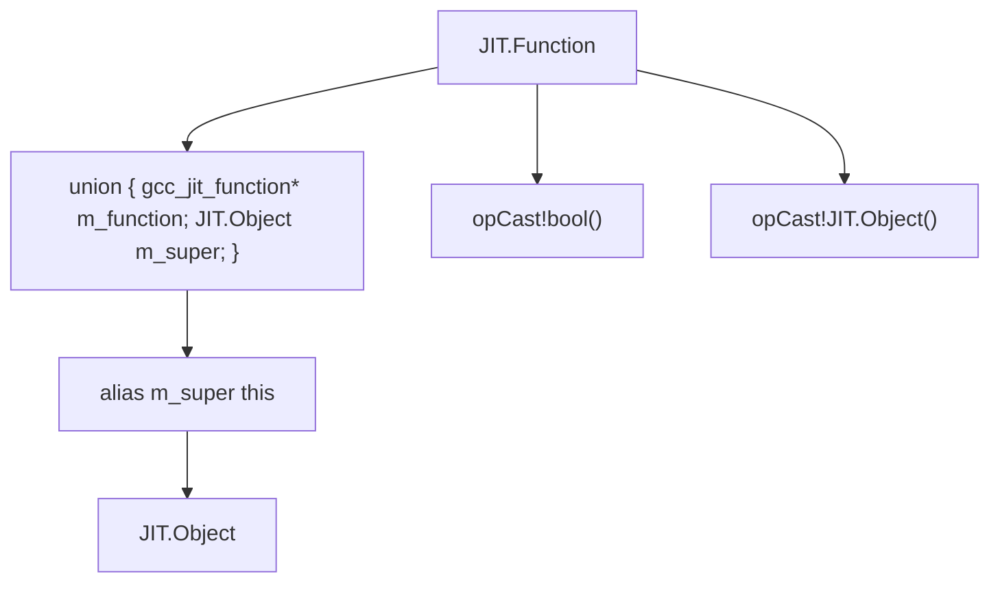
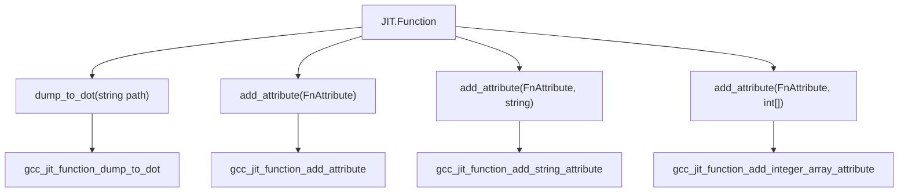

# Function and Parameter Structs

## Purpose and Scope

This page documents the `JIT.Function` and `JIT.Parameter` struct wrappers. These structs encapsulate libgccjit function declarations, parameters, control-flow block generation, local storage allocation, function attributes, reflection queries, and type conversions.

## Function Struct Architecture and Layout

The `JIT.Function` struct wraps `gcc_jit_function*` using the standard union-based inheritance pattern paired with `alias this` to inherit from `JIT.Object`.
Null-safety is provided via `opCast!bool` and upcasting to the base object layer is handled by `opCast!JIT.Object`.

## Block, Local Variable, and Temporary Allocation

Functions serve as containers for basic blocks (`JIT.Block`) and local storage locations (`JIT.LValue`).

- **Block Creation**: `new_block()` generates a new basic block within the function, optionally accepting a C-string name via `toCStringThen`
- **Local Variables**: `new_local()` allocates stack-based local variables tied to the function stack frame, with optional source location tracking
- **Compiler Temporaries**: `new_temp()` allocates compiler-generated temporary variables within the function scope, introduced in libgccjit  ABI version 33 and guarded by `JIT.Have_Function_new_temp`.

## Function Inspection, Reflection, and Addressing

The `JIT.Function` struct exposes several methods for querying function properties and obtaining references:

- **Parameters**: `get_param(int index)` retrieves a specific parameter by its integer index, returning a `JIT.Parameter` wrapper
- **Function Address**: `get_address(Location loc)` obtains a `JIT.RValue` representing the function's address, added in libgccjit ABI version 8 (`JIT.Have_Function_get_address`).
- **Reflection Queries**: `get_return_type()` and `get_param_count()` query function signatures, added in libgccjit ABI version 16 (`JIT.Have_Reflection`).

## Function Attributes and Debugging

Functions support metadata annotation and visualization:

- **Attributes**: `add_attribute()` attaches `FnAttribute` flags, string arguments, or integer array attributes to the function, added in libgccjit ABI version 26 (`JIT.Have_Attributes`).
- **Control Flow Visualization**: `dump_to_dot(string path)` dumps the function's control flow graph representation into a Graphviz DOT file

## Parameter Struct Handling

Parameters represent formal arguments defined on a `JIT.Function`. A `JIT.Parameter` can be retrieved via `JIT.Function.get_param()` and participates in the D wrapper hierarchy. It supports null checking via `opCast!bool` and type casting to `JIT.LValue`, `JIT.RValue`, and `JIT.Object` to allow parameters to be used transparently as expression values or assignable storage locations within function bodies.