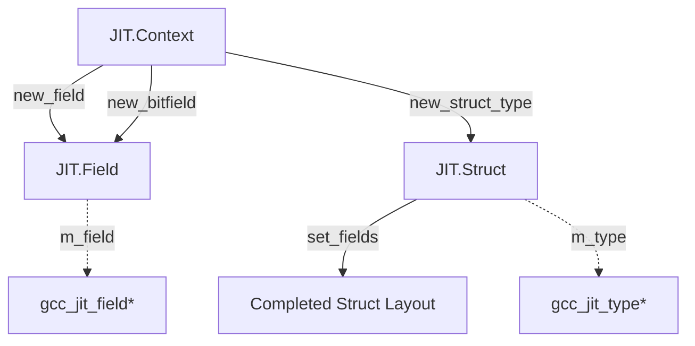
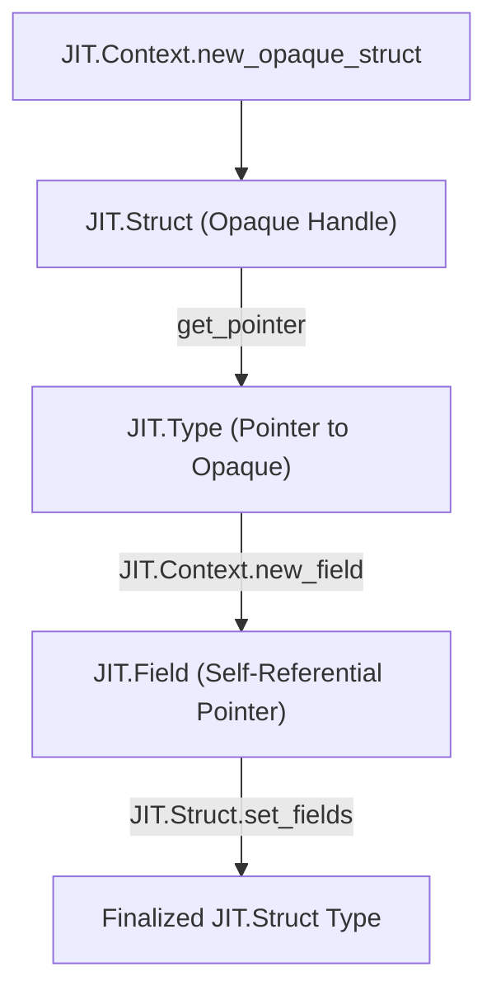

# Field Struct and Struct Layout

## Purpose and Scope

This page documents the `JIT.Field` struct wrapper and its integration with struct layout creation via the type and context subsystems. It covers the internal union/`alias this` layout inheritance pattern, null-checking via `opCast!bool`, safe upcasting to `JIT.Object` via `opCast!JIT.Object`, field factory methods (`JIT.Context.new_field`, `JIT.Context.new_bitfield`), struct type creation (`JIT.Context.new_struct_type`, `JIT.Struct.set_fields`), and the opaque struct forward-declaration pattern used for self-referential or mutually recursive data types.

## The Field Struct Wrapper

The `JIT.Field` struct encapsulates the raw C pointer `gcc_jit_field*` representing a field within a structure or union. Following the core architecture pattern of gccjitd, Field implements a union-based inheritance model where `JIT.Object` acts as the base wrapper via `alias this`

### Nullability and Casting
 
`JIT.Field` supports idiomatic null checking through an `opCast` overload for `bool`, which inspects the underlying `gcc_jit_field*` pointer. Upcasting to the parent `JIT.Object` is performed via `opCast!JIT.Object`, which invokes the underlying C upcast function `gcc_jit_field_as_object`.

Package-internal accessor methods (`get_field`) provide direct access to the raw C pointer for interoperation with the binding layer without exposing raw pointers publicly.

## Struct Layout and Field Creation Workflow
 
Constructing aggregate types (structures and unions) in gccjitd involves a multi-step factory workflow managed by `JIT.Context` and `JIT.Struct`:
 
1. **Field Declaration**: Fields are created via context factory methods such as `JIT.Context.new_field` and `JIT.Context.new_bitfield`, specifying a source location, field type, and field name.
2. **Structure Type Declaration**: An empty or forward-declared struct type is created via `JIT.Context.new_struct_type` or `JIT.Context.new_opaque_struct`.
3. **Field Binding**: The fields are bound to the struct type using `JIT.Struct.set_fields`.
 
### Diagram: Struct Layout and Field Code Entities
 

## The Opaque Struct Forward-Declaration Pattern

When defining self-referential structures (such as linked lists or tree nodes where a struct contains a pointer to itself) or mutually recursive structs, direct definition is impossible because the struct type size is incomplete when the inner field is declared. gccjitd supports libgccjit's opaque struct forward-declaration pattern to solve this:

1. Create an opaque structure handle using `JIT.Context.new_opaque_struct` with a given name.
2. Obtain a pointer type to this opaque struct using `JIT.Struct.get_pointer()`.
3. Define fields that reference this pointer type.
4. Finalize the struct layout using `JIT.Struct.set_fields` once all fields are constructed.

### Diagram: Opaque Struct Forward-Declaration Lifecycle

## Summary of Key Operations

| Operation | Code Entity / Function | Description |
|-----------|------------------------|-------------|
| Field Wrapper | `JIT.Field` struct | Wraps `gcc_jit_field*` with `JIT.Object` inheritance via `alias this` |
| Null Check | `opCast!bool` | Returns true if `m_field` is non-null. |
| Upcast | `opCast!JIT.Object` | Converts `JIT.Field` to base `JIT.Object` via `gcc_jit_field_as_object`. |
| Field Creation | `JIT.Context.new_field` / `JIT.Context.new_bitfield` | Factory methods for standard and bitfield structure members. |
| Struct Definition | `JIT.Context.new_struct_type` / `JIT.Struct.set_fields` | Instantiates and populates the aggregate layout. |