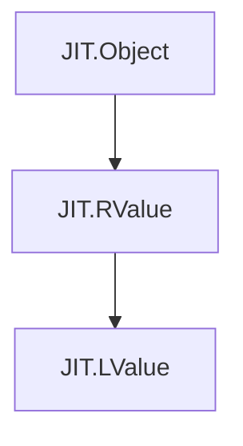

# Values: RValue and LValue

gccjitd provides a foundational expression and storage location system. It defines two central wrapper structs—`JIT.RValue` and `JIT.LValue`—which map directly to libgccjit's `gcc_jit_rvalue*` and `gcc_jit_lvalue*` opaque pointers.

Expressions (`JIT.RValue`) represent computations, constants, and function calls that yield a value, while storage locations (`JIT.LValue`) represent assignable memory locations such as local variables, global variables, and parameters. Both participate in the standard gccjitd object model via union-based `alias this` inheritance from `JIT.Object`, support idiomatic boolean null-checks (`opCast!bool`), and enable clean integration with D's operator overloading.

## Architecture and Inheritance

Both `JIT.RValue` and `JIT.LValue` follow the standard library-wide struct layout pattern: an anonymous union containing the underlying C pointer and a `JIT.Object` super-instance, with `alias m_super this;` establishing inheritance. `JIT.LValue` inherits from `JIT.RValue` (as every lvalue can be treated as an rvalue in expressions), which in turn inherits from `JIT.Object`.

*Figure 1: Inheritance hierarchy of JIT value wrappers.*

## RValue: Expressions and Operator Overloading

`JIT.RValue` represents any expression that can be evaluated. It provides methods for obtaining expression types, accessing fields, dereferencing pointers, performing type casts, and marking tail-call optimization flags (guarded by `JIT.Have_RValue_set_require_tail_call`).

To make expression building fluent, `JIT.RValue` overloads a broad set of D operators, allowing arithmetic, bitwise shifts, logical comparisons, array indexing (`opIndex`), and pointer dereferencing (`opUnary!"*"`) to be written using natural syntax.

For detailed method signatures, casting behavior, and operator forwarding rules, see the child page:

- [RValue: Expressions and Operator Overloading](7.1-rvalues.md)

## LValue: Storage Locations and Global Variable Configuration

`JIT.LValue` represents an addressable storage location. Because `JIT.LValue` inherits from `JIT.RValue`, any storage location can be implicitly used in expressions where an `JIT.RValue` is expected. Additionally, `JIT.LValue` provides methods to take the address of a variable, configure global variable attributes (such as link sections, TLS models, read-only status, alignment, and initializers), and perform array element access.

For detailed configuration properties and memory layout controls, see the child page:

- [LValue: Storage Locations and Global Variable Configuration](7.2-lvalues.md)
