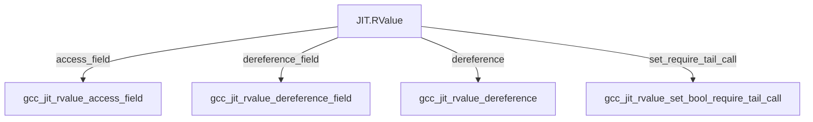
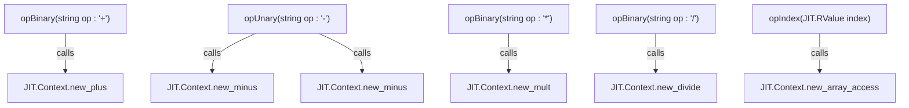

# RValue: Expressions and Operator Overloading

## Purpose and Scope

This page documents the `JIT.RValue` struct, which serves as the D wrapper for `gcc_jit_rvalue*`. A `JIT.RValue` represents an expression that can be evaluated within JIT-compiled code. This document covers its internal layout, core inspection and manipulation methods, pointer and field access utilities, tail-call optimization controls, and its comprehensive suite of D operator overloads.

## JIT.RValue Struct Layout and Core Casts

The `JIT.RValue` struct uses D's union/alias-this pattern to wrap the underlying C pointer `gcc_jit_rvalue*` while inheriting the base methods of `JIT.Object`.

- `opCast(T : bool)`: Allows checking if the `JIT.RValue` holds a valid non-null C pointer using idiomatic expressions like `if (rvalue)`.
- `opCast(T)` for `JIT.Object`: Upcasts the `JIT.RValue` into its parent `JIT.Object` via `gcc_jit_rvalue_as_object`.

## Expression Inspection and Conversion Methods

`JIT.RValue` exposes methods to query its type and perform explicit casts.

| Method Signature | Return Type | C Binding / Underlying Action | Description |
|------------------|-------------|-------------------------------|-------------|
| `get_type()` | `JIT.Type` | `gcc_jit_rvalue_get_type` | Returns the Type associated with this expression. |
| `cast_to(JIT.Location, JIT.Type)` | `JIT.RValue` | `JIT.Context.new_cast` | Converts the expression to the target `JIT.Type` at a given source location. |
| `cast_to(JIT.Type)` | `JIT.RValue` | `cast_to(JIT.Location(), type)` | Convenience overload with a default empty location. |
| `cast_to(JIT.Location, CType)` | `JIT.RValue` | `JIT.Context.get_type(kind)` | Converts the expression to a primitive `CType` kind at a given location. |
| `cast_to(CType)` | `JIT.RValue` | `cast_to(Location(), ...)` | Convenience overload for primitive `CType` casting. |

## Field Access and Pointer Operations

Values representing structures or pointers support member access, dereferencing, and tail-call configuration.

### Detailed Field & Pointer Methods

- `access_field(JIT.Location loc, JIT.Field field)` / `access_field(JIT.Field field)`: Equivalent to `(value).field` on an rvalue of struct type, returning a new `JIT.RValue`.
- `dereference_field(Location loc, Field field)` / `dereference_field(Field field)`: Equivalent to `(*value).field` on an rvalue of pointer type, returning a `JIT.LValue`.
- `dereference(Location loc)`: Equivalent to `*(value)` on an rvalue of pointer type, returning an `JIT.LValue`.
- `set_require_tail_call(bool require_tail_call)`: Marks or clears a call rvalue (created via `JIT.Context.new_call`) as requiring tail-call optimization. Requires libgccjit ABI version 6 (guarded by `JIT.Have_RValue_set_require_tail_call`).

## D Operator Overloads

`JIT.RValue` implements numerous D operator overloads to provide a concise, expression-oriented API. All operator methods delegate back to factory methods on the owning `JIT.Context` retrieved via `get_context()`.

### Operator Mapping Reference

| D Operator / Overload | Parameter(s) | Delegated Context Factory Method |
|-----------------------|--------------|----------------------------------|
| `opIndex`	| `JIT.RValue index` / `int index` | `new_array_access` |
| `opUnary!"-"` | none | `new_minus` |
| `opUnary!"~"` | none | `new_bitwise_negate` |
| `opBinary!"+"` | `JIT.RValue b` | `new_plus` |
| `opBinary!"-"` | `JIT.RValue b` | `new_minus` |
| `opBinary!"*"` | `JIT.RValue b` | `new_mult` |
| `opBinary!"/"` | `JIT.RValue b` | `new_divide` |
| `opBinary!"%"` | `JIT.RValue b` | `new_modulo` |
| `opBinary!"&"` | `JIT.RValue b` | `new_bitwise_and` |
| `opBinary!"^"` | `JIT.RValue b` | `new_bitwise_xor` |
| `opBinary!"\|"` | `JIT.RValue b` | `new_bitwise_or` |
| `opBinary!"<<"` | `JIT.RValue b` | `new_lshift` |
| `opBinary!">>"` | `JIT.RValue b` | `new_rshift` |
| `opUnary!"*"`	| none | `dereference` |