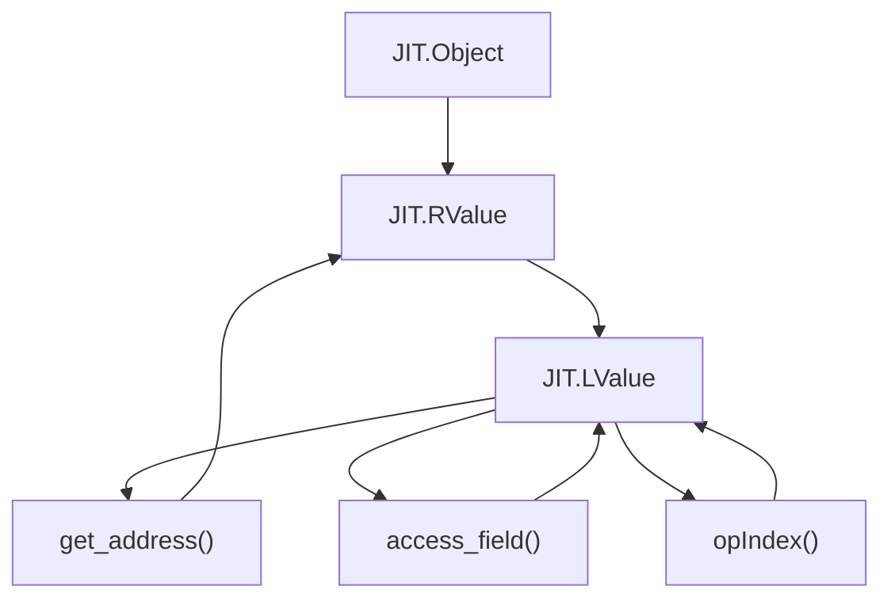
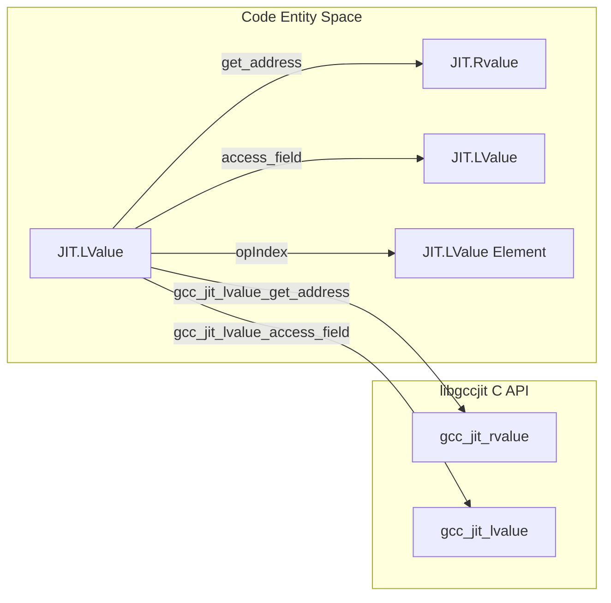

# LValue: Storage Locations and Global Variable Configuration

The `JIT.LValue` struct represents an assignable storage location within JIT-compiled code, corresponding to the underlying C type `gcc_jit_lvalue*`.
In libgccjit, an lvalue is a specialized form of rvalue that can appear on the left-hand side of an assignment, representing variables, parameters, memory dereferences, and field/array accesses.

This page details the methods provided by `JIT.LValue` for obtaining addresses, manipulating fields and array indices, and configuring global variables and storage attributes such as thread-local storage models, link sections, alignments, and custom register names.

## Overview of LValue and Inheritance

Like other wrapper structs in gccjitd, `JIT.LValue` employs a union-based inheritance pattern with `alias this` to integrate seamlessly with both `JIT.RValue and `JIT.Object`.
Because any lvalue can be evaluated as an rvalue, `JIT.LValue` inherits or provides conversion paths to `JIT.RValue and `JIT.Object`, enabling lvalues to be passed directly wherever an rvalue or base JIT object is expected.

Null-checking for `JIT.LValue` is performed via the idiomatic `opCast(T : bool)` operator, which checks if the underlying `gcc_jit_lvalue*` pointer is non-null.

*Figure 1: LValue Inheritance Hierarchy and Expression Flow*

## Address Taking and Structural Access

`JIT.LValue` provides methods to inspect storage locations, take their addresses, and traverse aggregate or array structures:

- `get_address(JIT.Location loc = JIT.Location())`: Returns a `JIT.RValue` representing the memory address of the lvalue `(&lvalue)`, wrapping `gcc_jit_lvalue_get_address`. An overloaded variant without parameters uses a default "no location" value.
- `access_field(JIT.Location loc, JIT.Field field)` / `access_field(JIT.Field field)`: Accesses a member field of a struct lvalue, returning a nested `JIT.LValue` (`lvalue.field`) via `gcc_jit_lvalue_access_field`
- `opIndex(RValue index)` / `opIndex(int index)`: Overloads array indexing to compute an element lvalue (`lvalue[index]`), delegating to `JIT.Context.new_array_access`

*Diagram 2: LValue Transformation Mapping to libgccjit C Functions*

## Global Variable and Storage Configuration

When working with global variables and static storage locations created via `JIT.Context.new_global`, `JIT.LValue` exposes a comprehensive set of configuration methods that map directly to libgccjit attribute and modifier entrypoints:

| Method Name | Description	| Underlying C / Helper Mechanism |
|-------------|-------------|---------------------------------|
| `set_initializer(JIT.RValue init)` / `set_initializer(int init)` |  Sets the initial value of a global variable. |`gcc_jit_lvalue_set_initializer` |
| `set_readonly(bool readonly)` | Marks a global variable as read-only (const storage). | `gcc_jit_global_set_read_only` |
| `set_tls_model(TlsModel model)` | Configures the Thread-Local Storage (TLS) model (`TlsModel` enum from `gccjit.flags`). | `gcc_jit_lvalue_set_tls_model` |
| `set_link_section(string name)` | Assigns the global variable to a specific ELF link section. | `gcc_jit_lvalue_set_link_section` |
| `set_register_name(string name)` | Associates the lvalue with a specific CPU register (for register variables). | `gcc_jit_lvalue_set_register_name` |
| `set_alignment(uint alignment)` | Sets the memory alignment constraint in bytes. | `gcc_jit_lvalue_set_alignment` |
| `get_alignment()` | Queries the current memory alignment constraint. | `gcc_jit_lvalue_get_alignment` |
| `add_attribute(string name)` | Attaches a variable attribute (`VarAttribute`) to the lvalue. | `gcc_jit_lvalue_add_attribute` | 