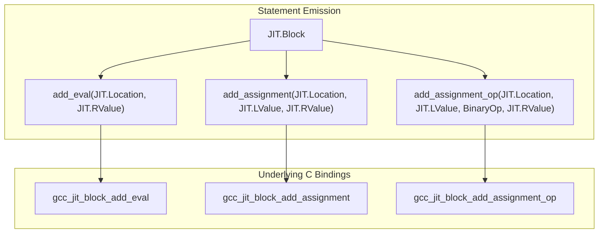
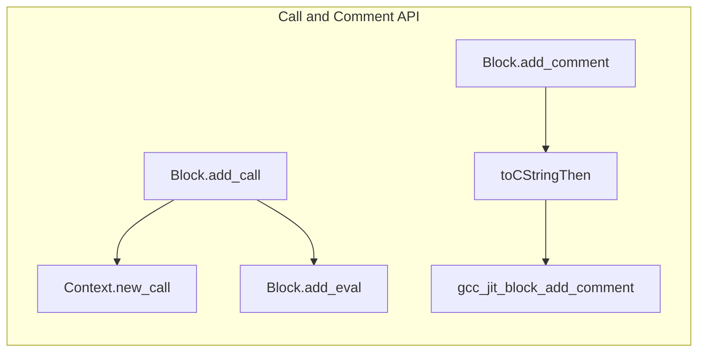
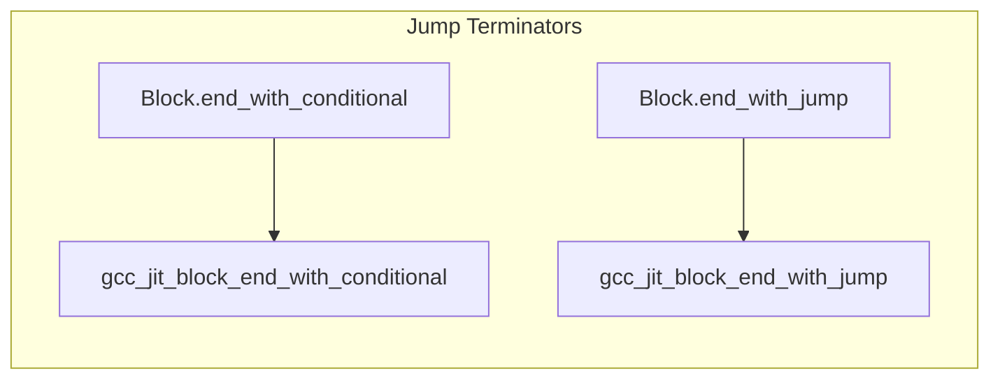

# Block: Statement Emission and Termination

## Purpose and Scope

This page documents the statement emission and basic block termination methods of the `JIT.Block` struct. A `JIT.Block` (`gcc_jit_block*`) represents a basic block within a control flow graph of a JIT-compiled function. The API provides fluent builder methods (returning `JIT.Block` with return scope attribute) that allow appending intermediate representation (IR) statements—such as evaluations, assignments, operator assignments, function calls, and debugging comments—as well as terminal control flow instructions that transfer execution to successor blocks or return from the function.

## Statement Emission Methods

The `JIT.Block` struct provides several methods to emit instructions into the basic block. Each method accepts an optional Location object (defaulting to a null/no-location value) to associate source code debugging positions with the emitted IR.

### Evaluation and Assignment

- `add_eval`: Evaluates a `JIT.RValue` expression purely for its side effects, discarding the resulting value. It wraps `gcc_jit_block_add_eval`
- `add_assignment`: Assigns a `JIT.RValue` to a `JIT.LValue`, equivalent to the C statement `lvalue = rvalue`. It wraps `gcc_jit_block_add_assignment`
- `add_assignment_op`: Performs an compound assignment using a `BinaryOp` enumeration value, equivalent to `lvalue op= rvalue`. It wraps `gcc_jit_block_add_assignment_op`

### Calls and Comments

- `add_call`: Invokes a `JIT.Function` with a slice or variadic list of `JIT.RValue` arguments. It creates a call expression via `get_context().new_call`() and immediately appends it to the block using `add_eval()`
- `add_comment`: Inserts a no-op textual comment into the internal representation. The string is converted to a C-style string using `toCStringThen` before calling `gcc_jit_block_add_comment`. These comments are visible in tree and GIMPLE dumps when debug options are enabled.

## Block Termination Methods

Every basic block must be explicitly terminated with a control flow instruction. Attempting to compile a function containing unterminated blocks results in compilation errors reported by the JIT context.

### Conditional and Unconditional Jumps

- `end_with_conditional`: Terminates the block by evaluating an `JIT.RValue` condition (val``), branching to on_true if non-zero, or on_false otherwise. It wraps `gcc_jit_block_end_with_conditional`
- `end_with_jump`: Terminates the block with an unconditional jump to a target block (`target`), equivalent to `goto target`. It wraps `gcc_jit_block_end_with_jump`

### Return Terminators

- `end_with_return`: Terminates the block by returning a `JIT.RValue `expression from the function, equivalent to return rvalue. It wraps `gcc_jit_block_end_with_return`
- `end_with_void_return`: Terminates the block with a valueless return statement for functions returning void, equivalent to a plain return.