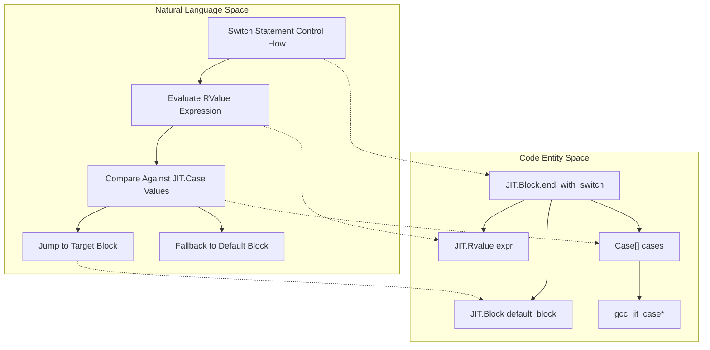
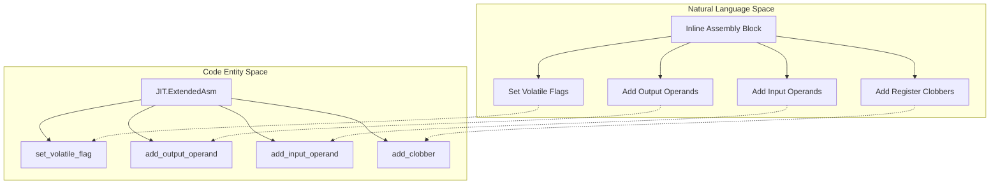

# ExtendedAsm and Case: Inline Assembly and Switch Statements

## Purpose and Scope

This page documents advanced control flow and low-level hardware integration features in gccjitd: the `JIT.Case` struct used for multi-way switch statement branches, and the `JIT.ExtendedAsm` struct used for embedding extended inline assembly instructions within basic blocks.

Because upstream libgccjit introduces these capabilities in later ABI versions, both subsystems are conditionally available and strictly gated at runtime by `JIT.Have_Switch_Statements` and `JIT.Have_Asm_Statements`.

## Switch Statements and the Case Struct

Switch statements in gccjitd allow branching to multiple target basic blocks based on the evaluated value of a `JIT.RValue` expression.
The transition is managed by terminating a `JIT.Block` using `end_with_switch`, which accepts a set of `JIT.Case` instances alongside a default fallback block.

### The Case API

The `JIT.Case` struct wraps the underlying `gcc_jit_case*` opaque C pointer. It adheres to the standard wrapper pattern in gccjitd, featuring union-based storage, alias-this inheritance for upcasting to `JIT.Object`, and an `opCast!bool` implementation to check for validity.

- *Construction*: Cases are constructed via context factory methods representing a discrete integer range or single value mapping to a target `JIT.Block`.
- (Termination): `Block.end_with_switch(Location loc, RValue expr, Block default_block, scope Case[] cases)` consumes the constructed Case array to emit the switch bytecode.

*Diagram 1: Switch Statement Control Flow to Code Entities.*

## Inline Assembly via ExtendedAsm

The `JIT.ExtendedAsm` struct provides an interface to GCC's extended inline assembly mechanism (asm volatile, constraints, input/output operands, and clobbers) within JIT-compiled basic blocks.

### Core Configuration and Methods

A `JIT.ExtendedAsm` instance is attached to a block or function context and configured via specialized builder methods:

- `set_volatile_flag(bool flag)`: Marks the inline assembly block as volatile, preventing the optimizer from deleting or reordering it even if its outputs appear unused (implied by libgccjit bindings).
- `set_inline_flag(bool flag)`: Suggests that the compiler should inline the assembly block where appropriate.
- `add_output_operand(string asm_symbolic_name, string constraint, JIT.LValue dest)`: Associates an assembly output operand with a local or global `JIT.LValue` destination using constraint strings (e.g., `"=r"`).
- `add_input_operand(string asm_symbolic_name, string constraint, RValue src)`: Binds an input `JIT.RValue` expression to an assembly parameter using input constraints (e.g., `"r"`).
- `add_clobber(string victim)`: Informs the register allocator about registers or memory locations modified by the assembly block (e.g., `"memory"`, `"cc"`).
- **Top-Level Assembly**: Allows injecting assembly statements outside of any function scope directly at the translation unit level.

*Diagram 2: ExtendedAsm Builder Pattern Mapping.*

## Feature Gating: Have_Asm_Statements and Have_Switch_Statements

Because libgccjit evolves independently of the D binding layer, feature availability is dynamically verified at runtime rather than relying solely on link-time checks.

- `JIT.Have_Switch_Statements`: Generated by the `Have ` string-mixin, this property checks whether the underlying shared library exports switch statement entrypoints.
- `JIT.Have_Asm_Statements`: Similarly generated, this flag confirms support for `JIT.ExtendedAsm` constructors and operand management functions.

Attempting to invoke assembly or switch methods when their respective `Have_*` flag evaluates to false triggers symbol resolution safety fallbacks or abort paths defined in helper modules.