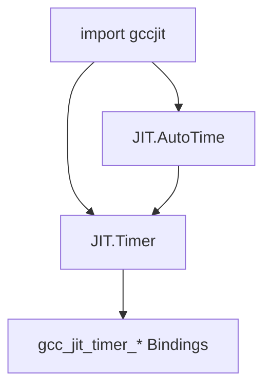
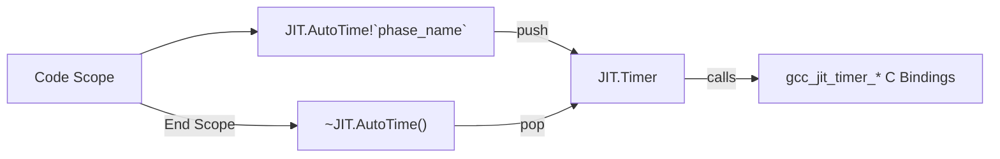

# Timer and Profiling

This page provides an overview of the profiling and phase timing support in gccjitd. The profiling subsystem allows monitoring and breaking down the execution time of various JIT compilation phases using `gcc_jit_timer`.

Profiling features are gated by the `JIT.Have_Timing_API` feature flag because they were introduced in libgccjit ABI version 4.

For details on each profiling component, see the child pages:

- [Timer: Phase Timing API](9.1-timer.md)
- [AutoTime: Scoped Timing](9.2-autotime.md)

## Architecture Overview

The profiling mechanism consists of two main abstractions exposed via the gccjit module:

- `JIT.Timer`: A struct wrapper around the underlying `gcc_jit_timer*` C pointer. It supports lazy allocation (`m_start`), pushing and popping named timing items, printing reports to a `FILE*` stream, and releasing resources. A `JIT.Timer` instance can be associated with a compilation context via `JIT.Context.timer()`.
- `JIT.AutoTime`: A scoped RAII template struct that automatically pushes a named timing item (`item_name`) upon construction and pops it when the scope exits via its destructor.

