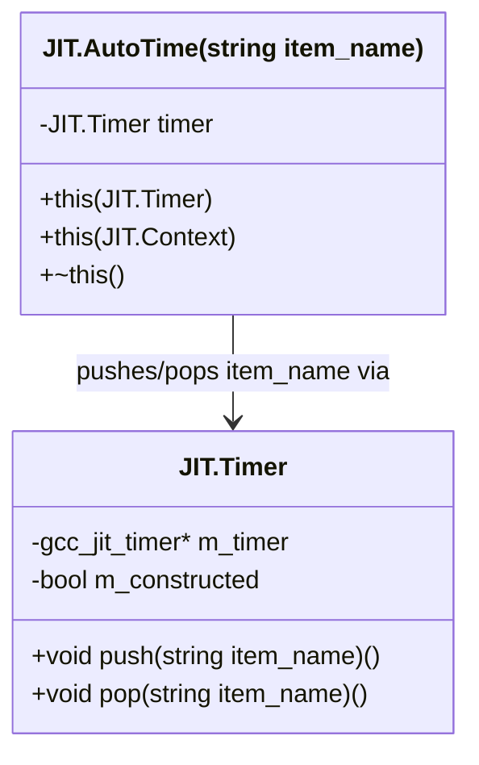
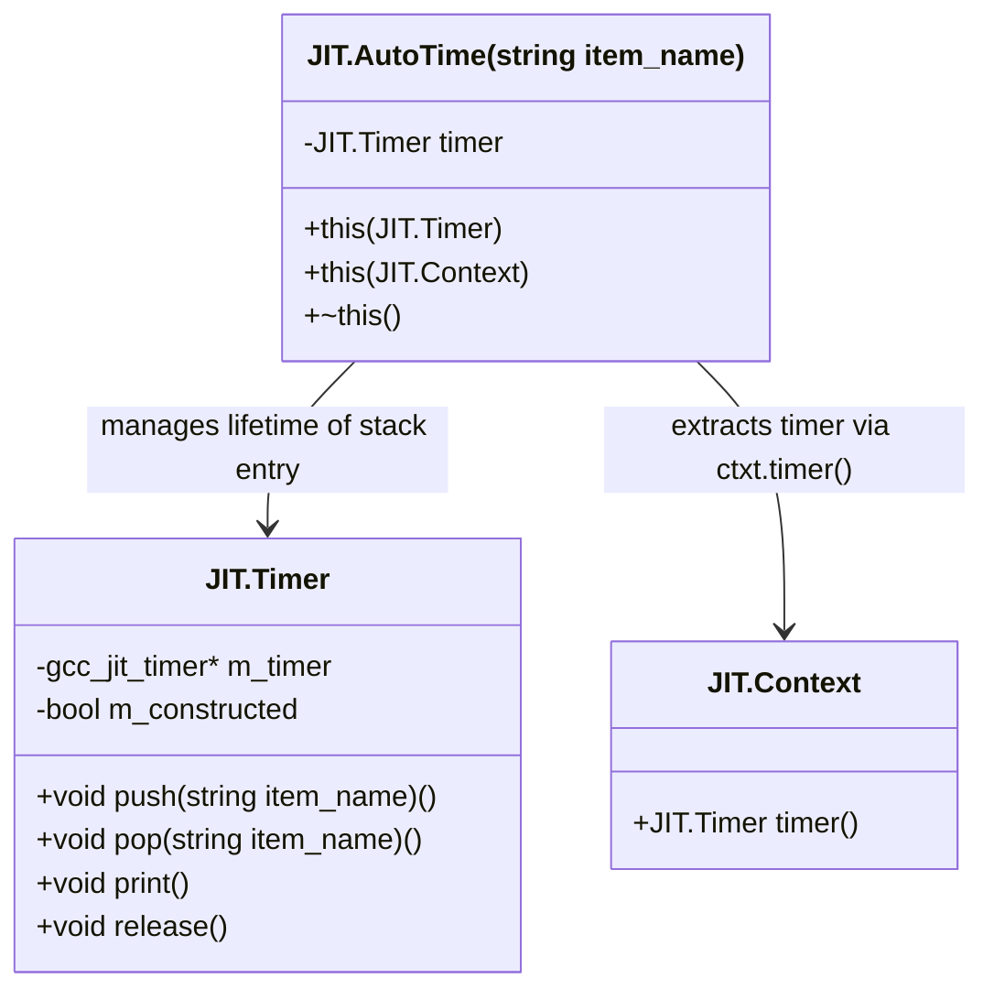

# AutoTime: Scoped Timing

## Purpose and Scope

This page documents the `JIT.AutoTime` RAII template. `JIT.AutoTime` automates profiling stack management by pushing a named timing item onto a `JIT.Timer` instance upon construction and automatically popping it when the scope exits via its destructor. This facility relies on the underlying libgccjit timing API and is guarded by the `JIT.Have_Timing_API` feature flag.

## Template Design and Structure

`JIT.AutoTime` is a templated struct parameterized by a compile-time string item_name. It implements the Resource Acquisition Is Initialization (RAII) idiom for JIT compilation profiling.



## Implementation Details

The `JIT.AutoTime` struct disables the default zero-argument constructor to ensure that every scoped timing block is explicitly associated with either an active Timer or a compilation `JIT.Context`

### Constructors and Destructor

- `this(Timer t)`: Accepts an existing `JIT.Timer` struct, ensures it is initialized via `Timer.m_start(t)`, and immediately invokes timer.`push!item_name()`
- `this(Context ctxt)`: Retrieves the timer associated with the given `JIT.Context` via `ctxt.timer()` and immediately invokes timer.`push!item_name()`
- `~this()`: The destructor automatically calls `timer.pop!item_name()` when the execution flow leaves the lexical scope where `JIT.AutoTime` was instantiated

```
// Conceptual usage pattern in D
{
    auto at = AutoTime!("compile-phase")(ctxt);
    // Compilation or JIT operations performed here...
} // ~AutoTime() automatically pops "compile-phase"
```

## Code Entity Mapping Diagram

The following diagram illustrates how natural language timing concepts bridge to the concrete code entities.

